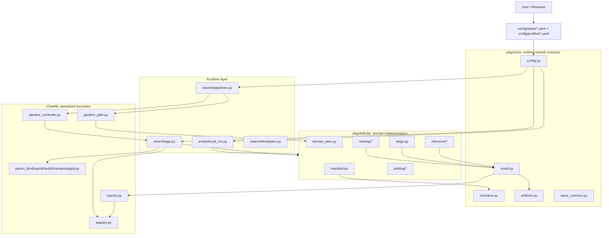
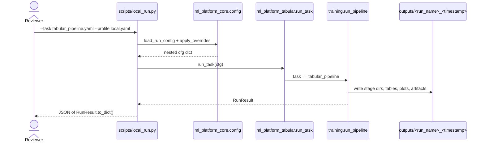
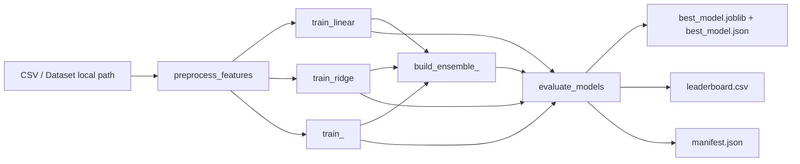
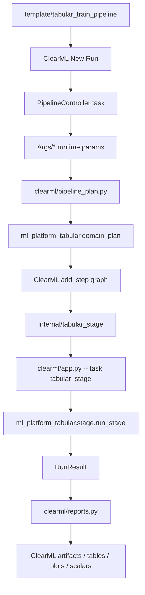
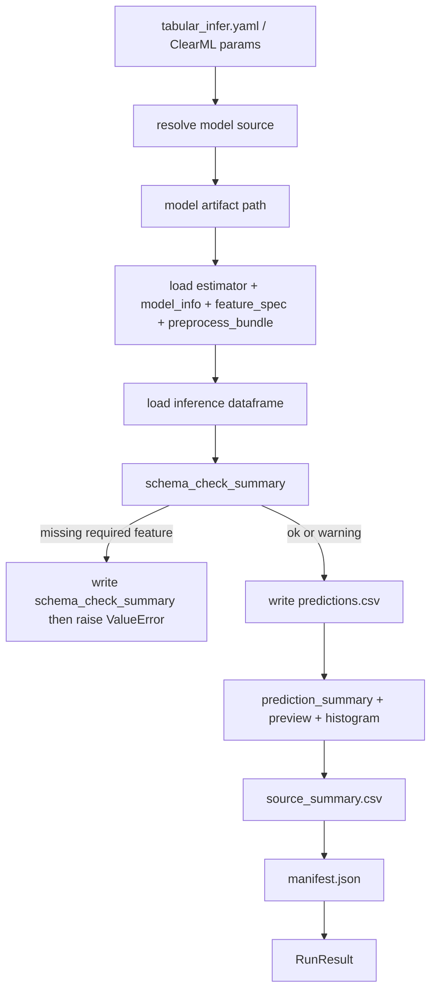
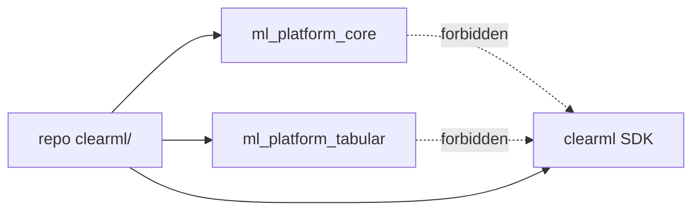
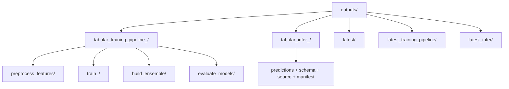
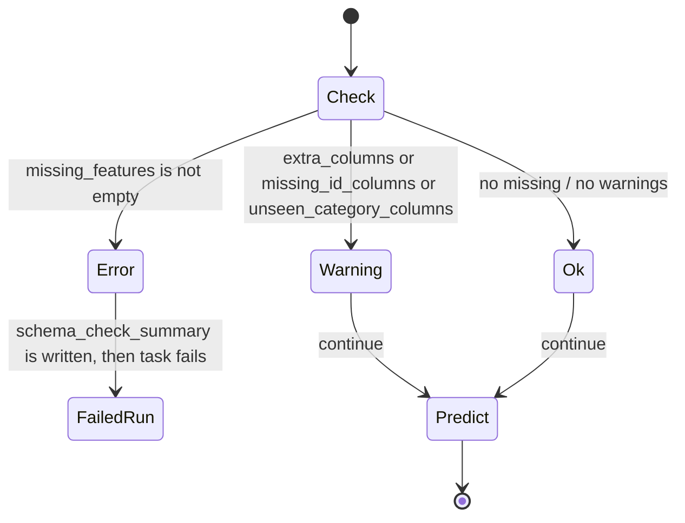

# Reviewwer Guide

このファイルは、レビュー担当者が `ml_platform` の現在の処理動線、ファイル責務、契約、診断出力、データの流れを短時間で把握するための地図です。

## 0. 先に見る場所

| 目的 | まず見るファイル | 補助で見るファイル |
| --- | --- | --- |
| 製品仕様の境界 | `docs/SPEC.md` | `docs/ROADMAP.md` |
| 実行契約 | `pkgs/core/src/ml_platform_core/contracts.py` | `pkgs/tabular/src/ml_platform_tabular/manifest.py` |
| ローカル実行 | `scripts/local_run.py` | `config/tasks/*.yaml`, `config/profiles/local.yaml` |
| ClearML 実行 | `clearml/app.py`, `clearml/pipelines.py` | `clearml/adapter.py`, `clearml/templates.py` |
| 学習処理 | `pkgs/tabular/src/ml_platform_tabular/training/orchestrator.py` | `training/*.py` |
| 推論処理 | `pkgs/tabular/src/ml_platform_tabular/inference/runner.py` | `inference/*.py` |
| 結果の読み方 | `ml_platform_core.result.RunResult` | `ml_platform_core.artifacts.write_manifest` |
| 回帰確認 | `tests/test_runtime_manifest.py` | `tests/test_pipeline_smoke.py`, `tests/test_tabular_smoke.py` |

## 1. 全体アーキテクチャ

`pkgs/core` と `pkgs/tabular` は ClearML SDK に依存しません。ClearML 固有処理は `clearml/` に閉じ込め、パッケージコードは `RunResult` とファイル出力だけを返します。



## 2. 製品スコープ

| 項目 | 現在の扱い |
| --- | --- |
| 対象問題 | tabular scalar regression |
| 学習グラフ | `preprocess_features -> train_<model>* -> build_ensemble_<method>* -> evaluate_models` |
| 推論 | 学習 Pipeline から分離した user-facing task |
| ClearML テンプレート | `tabular_train_pipeline_template`, `tabular_infer_template`, internal `tabular_stage_template` |
| 対応 split | `random`, `group`, `time`, `fixed` |
| 対応モデル | `linear`, `ridge`, `lasso`, `elasticnet`, `random_forest`, `extra_trees`, `gradient_boosting`, `lightgbm`, `xgboost`, `catboost` |
| optional dependency | `lightgbm`, `xgboost`, `catboost` は remote template 側で追加 |
| ensemble | `mean_topk`, `weighted`, `median` |
| 未実装 | HPO, model registry, drift monitoring, k-fold, nested CV, external validation file |

## 3. 実行動線

### 3.1 ローカル学習



### 3.2 ローカル学習 Pipeline 内部



### 3.3 ClearML 学習

ClearML では user-facing PipelineController と internal stage task を分けます。controller queue と stage queue を分ける前提です。



### 3.4 推論



### 3.5 ClearML runtime parameter の往復

レビューではここが重要です。runtime parameter key は手書き分散ではなく、`ml_platform_tabular.manifest.ParameterSpec` から導出します。


| ファイル | 役割 | レビュー観点 |
| --- | --- | --- |
| `manifest.py` | runtime parameter の宣言元 | 新しい UI key はまずここにあるか |
| `param_bindings.py` | `Input/local_path` などを `cfg["data"]["local_path"]` に対応付け | key の重複・型衝突がないか |
| `param_defaults.py` | YAML config から ClearML の初期値を作る | New Run の初期表示が妥当か |
| `param_transport.py` | JSON/list/bool/int/float を ClearML transport 用に正規化・復元 | list/dict が文字列のまま漏れないか |
| `param_apply.py` | UI で編集された値を nested config に反映 | 空文字を許す key と無視する key が正しいか |

## 4. ファイル責務マップ

### 4.1 `pkgs/core`

| ファイル | 責務 | 変更時の注意 |
| --- | --- | --- |
| `contracts.py` | `ArtifactSpec`, `ParameterSpec`, `StageSpec`, `TaskSpec`, `PipelineSpec`, `PackageManifest`, `DomainPipelinePlan` | runtime 非依存の契約だけを置く |
| `result.py` | package runner が返す `RunResult` | ClearML 固有フィールドを増やさない |
| `artifacts.py` | run dir 作成、config snapshot、manifest 書き出し、latest copy | manifest schema を変えたら読み手とテストを更新 |
| `config.py` | task/profile YAML の merge と CLI override | ClearML UI key ではなく nested config を扱う |
| `io.py` | JSON/table/joblib などの IO | artifact format の責任境界 |
| `stages.py` | stage name の型と validation | stage key を増やすなら manifest と同期 |
| `value_coercion.py` | bool/list/dict/candidates の型変換 | ClearML と CLI override の両方に影響 |

### 4.2 `pkgs/tabular`

| 領域 | ファイル | 責務 |
| --- | --- | --- |
| manifest | `manifest.py` | tabular domain の task/stage/pipeline/parameter/artifact 契約 |
| runner dispatch | `runners.py`, `__init__.py` | `task` 名から `run_pipeline` / `run_stage` / `run_infer` を呼ぶ |
| graph planning | `domain_plan.py` | runtime-neutral な学習 step 展開 |
| product policy | `policy.py` | model suite, quality mode, primary graph guard |
| models | `models.py` | supported model, optional dependency error, estimator wrapper |
| feature | `features.py`, `data.py`, `data_quality.py` | CSV 読み込み、split、前処理、品質診断 |
| metric/selection | `metrics.py`, `selection.py` | regression metrics と選択 metric の共通判定 |
| plotting | `plotting/*.py` | leaderboard, prediction, feature, summary plot/table writer |
| stage runner | `stage.py`, `stage_inputs.py`, `stage_result.py` | ClearML stage task で分割実行する入口 |
| training | `training/*.py` | preprocessing, candidate training, ensemble, evaluation, output maps |
| inference | `inference/*.py` | model source 解決、metadata load、schema check、prediction 出力 |

### 4.3 `clearml`

| ファイル | 責務 | パッケージ境界 |
| --- | --- | --- |
| `_entrypoint_bootstrap.py` | remote/local entrypoint の import path 調整 | ClearML entrypoint 専用 |
| `adapter.py` | ClearML SDK import, Task/Dataset/StorageManager/Logger wrapper | SDK 直接 import はここ経由 |
| `support.py` | Task tag/comment/script/logger helper | 共通 ClearML helper |
| `app.py` | stage/infer task entrypoint | package runner を呼ぶだけに寄せる |
| `pipelines.py` | PipelineController CLI entrypoint | pipeline sync/run の入口 |
| `templates.py` | ClearML template task sync | user-facing/internal template 管理 |
| `pipeline_plan.py` | PipelineController の step plan 生成 | domain plan を ClearML step に変換 |
| `pipeline_controller.py` | PipelineController draft sync と step registration | ClearML 側の graph 実体化 |
| `source_resolution.py` | source_task_id / model_selector から artifact path を解決 | 推論時だけ使う |
| `reports.py` | `RunResult` を ClearML に upload/report | package は ClearML を知らない |
| `reporting_scalars.py` | metrics/table から scalar 抽出 | UI 表示最適化 |
| `reporting_targets.py` | report 対象 table/plot の選別 | 重複・巨大 table 抑制 |
| `param_*.py` | runtime param の default/transport/apply | manifest から派生する |

### 4.4 `config`, `scripts`, `tests`

| パス | 役割 |
| --- | --- |
| `config/tasks/tabular_pipeline.yaml` | user-facing 学習 Pipeline config |
| `config/tasks/tabular_stage.yaml` | internal stage task config |
| `config/tasks/tabular_infer.yaml` | user-facing 推論 task config |
| `config/profiles/local.yaml` | local runtime profile |
| `config/profiles/clearml-dev.yaml` | dev ClearML profile, queues, projects, remote defaults |
| `scripts/make_sample_data.py` | sample CSV 作成 |
| `scripts/local_run.py` | local runner |
| `scripts/clearml_pipeline.py` | ClearML PipelineController runner |
| `scripts/sync_clearml_templates.py` | ClearML template sync |
| `tests/test_runtime_manifest.py` | manifest/contract smoke |
| `tests/test_pipeline_smoke.py` | local training pipeline contract |
| `tests/test_stage_smoke.py` | stage 分割実行 contract |
| `tests/test_tabular_smoke.py` | model/feature/inference smoke |
| `tests/test_clearml_*.py` | ClearML mapping, params, reporting, templates, source resolution |

## 5. 契約一覧

### 5.1 Core dataclass contracts

| Contract | 主なフィールド | 役割 |
| --- | --- | --- |
| `ArtifactSpec` | `name`, `kind`, `required` | stage/task が期待する artifact の宣言 |
| `ParameterSpec` | `name`, `value_type`, `required`, `default`, `choices` | ClearML UI と config binding の元データ |
| `StageSpec` | `key`, `kind`, `runner_path`, `input_artifacts`, `output_artifacts`, `parameters` | package stage の安定契約 |
| `TaskSpec` | `key`, `kind`, `runner_path`, `parameters`, `artifacts`, `stage_keys` | user-facing/internal task の契約 |
| `PipelineSpec` | `key`, `stage_keys` | pipeline に含まれる stage key の契約 |
| `PackageManifest` | `domain`, `version`, `tasks`, `stages`, `pipelines`, `tags` | package が runtime に公開する全契約 |
| `DomainStepPlan` | `name`, `stage_key`, `parents`, `parameter_overrides`, `expected_artifacts` | runtime-neutral な Pipeline step |
| `DomainPipelinePlan` | `key`, `version`, `run_name`, `steps` | ClearML 以外でも解釈可能な graph plan |
| `RunResult` | `run_dir`, `metrics`, `artifacts`, `tables`, `plots`, `extra` | runtime adapter へ渡す標準結果 |

### 5.2 Tabular task contracts

| Task key | kind | runner | stage keys | user-facing |
| --- | --- | --- | --- | --- |
| `tabular_pipeline` | `pipeline` | `ml_platform_tabular.training:run_pipeline` | `preprocess_features`, `train_model`, `build_ensemble`, `evaluate_models` | Yes |
| `tabular_stage` | `stage` | `ml_platform_tabular.stage:run_stage` | `preprocess_features`, `train_model`, `build_ensemble`, `evaluate_models` | No, internal |
| `tabular_infer` | `task` | `ml_platform_tabular.inference:run_infer` | `infer` | Yes |

### 5.3 Stage contracts

| Stage key | kind | ClearML step label | 主な input | 最低 output artifact/table |
| --- | --- | --- | --- | --- |
| `preprocess_features` | `preprocess` | `preprocess_features` | raw data, split, features config | `preprocess_bundle`, `feature_spec`, `processed_train`, `processed_valid` |
| `train_model` | `train` | `train_<model>` | preprocess artifacts, `Model/name`, `Model/params` | `model`, `model_info`, `metrics`, `validation_predictions` |
| `build_ensemble` | `ensemble` | `build_ensemble_<method>` | preprocess artifacts, `Input/model_refs` | `model`, `model_info`, `ensemble_info`, `metrics`, `ensemble_predictions` |
| `evaluate_models` | `evaluate` | `evaluate_models` | `Input/model_refs`, optional `Input/ensemble_refs` | `leaderboard`, `best_model`, `best_model_json`, `metrics`, `evaluation_predictions` |
| `infer` | `infer` | `tabular_infer` | inference data, model source | `predictions`, `schema_check_summary`, `prediction_summary`, `prediction_preview`, `source_summary`, `prediction_distribution_histogram`, `manifest` |

### 5.4 Runtime parameter groups

| Group | 代表 key | nested config path | 備考 |
| --- | --- | --- | --- |
| `Basic` | `Basic/model_suite`, `Basic/quality_mode`, `Basic/use_ensemble` | policy 経由で `model.*` に反映 | Pipeline template の簡易操作面 |
| `Run` | `Run/task`, `Run/name`, `Run/seed`, `Run/stage` | `task`, `run.*` | stage は internal task 用 |
| `Input` | `Input/local_path`, `Input/clearml_dataset_id`, `Input/dataset_file` | `data.*` | ClearML Dataset は adapter が local path へ解決 |
| `Input` | `Input/target_column` | `data.target_column` | 学習は required、推論は optional |
| `Input` | `Input/model_refs`, `Input/ensemble_refs` | `stage_inputs.*` | Pipeline step handoff 用 |
| `Split` | `Split/method`, `Split/valid_size`, `Split/group_column` | `split.*` | 学習のみ |
| `Features` | `Features/preset`, impute, encoder, scaling, drop/passthrough | `features.*` | drop/passthrough は list transport |
| `Model` | `Model/candidates`, `Model/model_params_by_name` | `model.candidates`, `model.params` | `Model/params` は stage 単体用 |
| `Model` | `Model/source_type`, `Model/source_task_id`, `Model/model_selector` | `model.*` | 推論 source resolution 用 |
| `Model` | `Model/ensemble_methods`, `Model/ensemble_top_k` | `model.ensemble.*` | Pipeline ensemble 用 |
| `Output` | `Output/prediction_name`, `Output/chunk_size`, `Output/upload_plots` | `output.*` | 推論 chunk / plot upload 制御 |

### 5.5 `RunResult` contract

| フィールド | 型 | 内容 | ClearML での扱い |
| --- | --- | --- | --- |
| `run_dir` | `Path` | 実行単位の出力ディレクトリ | task artifact の source |
| `metrics` | `dict[str, float]` | scalar metrics / summary values | `report_scalar` |
| `artifacts` | `dict[str, Path]` | JSON/joblib/config/manifest など | `upload_artifact` |
| `tables` | `dict[str, Path]` | CSV tables | `report_table` 対象を選別 |
| `plots` | `dict[str, Path]` | PNG plots | `upload_artifact` と一部 report media |
| `extra` | `dict[str, Any]` | manifest extra に近い診断 metadata | local JSON output / tests |

### 5.6 `manifest.json` contract

全 run は `manifest.json` を持ちます。ローカルでは成果物探索、ClearML では artifact 一覧の補助に使います。

| key | 内容 |
| --- | --- |
| `created_at` | UTC timestamp |
| `task` | `tabular_pipeline`, `tabular_stage`, `tabular_infer` |
| `profile` | `local`, `clearml-dev` など |
| `run_name` | config の `run.name` |
| `run_dir` | 実行出力 directory |
| `config_meta` | config merge metadata |
| `metrics` | run-level metrics |
| `artifacts` | artifact 名、path、exists、sha256 |
| `tables` | table 名、path、exists、sha256 |
| `plots` | plot 名、path、exists、sha256 |
| `extra` | pipeline_kind, report_schema_version, schema_check_status など |

### 5.7 Import boundary contract



| ルール | 理由 | 検査 |
| --- | --- | --- |
| `pkgs/core` は ClearML を import しない | runtime-neutral な基盤を保つ | Import Linter contract |
| `pkgs/tabular` は ClearML を import しない | local/test/他 runtime で実行可能にする | Import Linter contract |
| `clearml/` は SDK を直接 import せず `adapter.import_clearml_*` 経由 | repo の `clearml/` ディレクトリ名が SDK を shadow しうる | grep / code review |
| package runner は `RunResult` を返す | runtime adapter と domain 実装を分離 | tests |

## 6. データと成果物

### 6.1 入力データ

| config key | 内容 | 学習 | 推論 |
| --- | --- | --- | --- |
| `data.local_path` | local CSV path | local では主入力 | local 推論の主入力 |
| `data.clearml_dataset_id` | ClearML Dataset ID | remote の推奨入力 | remote 推論でも利用可 |
| `data.dataset_file` | Dataset 内の file 名 | remote default で指定 | 必要に応じて指定 |
| `data.target_column` | 正解列 | required | optional |
| `data.feature_columns` | 明示 feature list | optional | optional。未指定なら学習時 spec 等から復元 |
| `data.id_columns` | 予測結果に残す ID 列 | optional | optional。feature spec からも復元 |

### 6.2 出力ディレクトリ



`latest*` は symlink ではなく copy です。Windows / ClearML Agent / mounted PVC の差異を避けるためです。

### 6.3 学習時の主な成果物

| Stage | 種別 | 名前 | 見る理由 |
| --- | --- | --- | --- |
| preprocess | artifact | `preprocess_bundle` | transformer と前処理情報 |
| preprocess | artifact | `feature_spec` | 推論で feature/id/target を復元する基準 |
| preprocess | artifact | `feature_summary`, `data_quality_summary` | feature と data quality の JSON 診断 |
| preprocess | table | `processed_train`, `processed_valid` | split 後 raw frame |
| preprocess | table | `train_features`, `valid_features` | transformed feature matrix |
| preprocess | table | `data_quality_summary_table`, `data_quality_warnings` | 品質診断 |
| train | artifact | `model_<name>`, `model_info_<name>`, `metrics_<name>` | model 実体・metadata・metric |
| train | table | `validation_predictions_<name>` | validation prediction 詳細 |
| train | plot | `validation_prediction_vs_actual_<name>`, residual plots | model 診断 |
| ensemble | artifact | `ensemble_<method>`, `ensemble_info`, `ensemble_refs` | ensemble 実体・参照 |
| ensemble | table | `ensemble_predictions_<method>`, `ensemble_members_<method>`, `ensemble_weights_<method>` | ensemble 内訳 |
| evaluate | table/artifact | `leaderboard` | 全候補比較の中心 |
| evaluate | artifact | `best_model`, `best_model_json` | 推論に渡す canonical decision |
| evaluate | table | `evaluation_predictions` | best candidate の prediction 詳細 |
| evaluate | plot | `leaderboard_metric_panel`, best prediction/residual plots | ClearML UI で最初に見る診断 |
| all | artifact | `manifest` | 出力索引と sha256 |

### 6.4 推論時の主な成果物

| 種別 | 名前 | 内容 |
| --- | --- | --- |
| table | `predictions` | `row_index`, ID 列, `prediction`, `model_name`, `artifact_kind`, `model_artifact_id`, `prediction_run_id` |
| artifact/table | `schema_check_summary` | feature/id/category の schema 診断 |
| table | `prediction_summary` | 予測値の集計 |
| table | `prediction_preview` | 予測結果の先頭行 |
| table | `source_summary` | model source, selector, resolved path, feature preset など |
| plot | `prediction_distribution_histogram` | 予測分布 |
| artifact | `manifest` | 推論 run の出力索引 |

`predictions.csv` は intentionally slim です。入力 feature 全列はコピーしません。

### 6.5 `predictions.csv` の列契約

| 列 | 内容 |
| --- | --- |
| `row_index` | 入力 dataframe 上の行番号 |
| configured / learned ID columns | `data.id_columns` または `feature_spec.id_columns` に存在する列 |
| `prediction` | 予測値 |
| `model_name` | 解決された model 名 |
| `artifact_kind` | `model` または `ensemble` |
| `model_artifact_id` | model_info と model path から作る軽量 ID |
| `prediction_run_id` | 推論 run directory 名 |

予約列に入力データが衝突する場合は `ValueError` になります。

## 7. 診断内容

### 7.1 Data quality diagnostics

| 出力 | 観点 |
| --- | --- |
| `data_quality_summary.json` | row count, target column, numeric target, split metadata |
| `data_quality_summary_table.csv` | ClearML UI に出す summary table |
| `data_quality_warnings.csv` | 欠損、重複、ID 重複、高 cardinality、leak 疑いなどの警告 |
| `missing_rate_by_column.csv` / plot | 欠損率 |
| `feature_summary.json` / table | feature config, transformed column, passthrough/drop 状態 |

警告は基本的に失敗扱いではありません。致命的な入力不備だけが例外になります。

### 7.2 Model / evaluation diagnostics

| 出力 | 観点 |
| --- | --- |
| `metrics.json`, `metrics_table.csv` | `rmse`, `mae`, `r2` など |
| `leaderboard.csv` | rank, model_name, artifact_kind, ensemble_method, infer_selector, infer_target, metric |
| `best_model.json` | 推論に使う `Model/source_type`, `Model/source_task_id`, `Model/model_selector` |
| `evaluation_predictions.csv` | best candidate の actual/prediction/residual |
| `leaderboard_metric_panel.png` | 候補比較 |
| `best_prediction_vs_actual.png` | 予測 vs 実測 |
| `best_residual_histogram.png` | residual 分布 |
| `best_residual_vs_predicted.png` | predicted value と residual の関係 |

### 7.3 Inference schema diagnostics



| `schema_check_summary` key | 意味 |
| --- | --- |
| `required_feature_count` | 推論に必要な feature 数 |
| `provided_feature_count` | 入力に存在した required feature 数 |
| `missing_features` | 欠落 feature。空でなければ `error` |
| `extra_columns` | 推論に使わない追加列。`warning` |
| `id_columns` | 実際に存在した ID 列 |
| `missing_id_columns` | 指定されたが存在しなかった ID 列。`warning` |
| `row_count` | 入力行数 |
| `unknown_or_unseen_category_warning` | 学習時にない category を検出したか |
| `unseen_category_columns` | unseen category を含む列 |
| `status` | `ok`, `warning`, `error` |

### 7.4 Source diagnostics

`source_summary.csv` は、推論結果がどの学習成果物から来たかを追跡するための table です。

| field | 内容 |
| --- | --- |
| `source_type` | `task_id` or `local_path` |
| `source_task_id` | ClearML source task ID |
| `model_selector` | `best`, model name, `ensemble`, `ensemble:<method>` |
| `resolved_model_name` | 実際に使った model 名 |
| `artifact_kind` | `model` or `ensemble` |
| `ensemble_method` | ensemble の method |
| `target_column` | 学習時 target |
| `feature_preset` | feature config preset |
| `schema_check_status` | schema check の最終 status |
| `resolved_model_path` | 実体 model artifact path |
| `model_artifact_id` | prediction にも入る ID |

## 8. ClearML UI でレビューするポイント

| 画面 | 見るもの | 期待 |
| --- | --- | --- |
| Templates | `template/tabular_train_pipeline`, `template/tabular_infer`, `internal/tabular_stage` | user-facing は 2 つ、stage は internal |
| Pipeline New Run | `Basic/*`, `Input/*`, `Model/*`, `Output/*` | `Input/target_column` は学習で必須、推論では任意 |
| Pipeline graph | `preprocess_features`, `train_<model>`, `build_ensemble_<method>`, `evaluate_models` | stage key と label の違いが意図どおり |
| Stage task | artifacts/tables/plots | `RunResult` の各 dict と一致 |
| Evaluate task | `leaderboard`, `best_model_json`, metrics plots | 推論に必要な selector が分かる |
| Infer task | `schema_check_summary`, `predictions`, `source_summary` | model source と schema status が追える |

## 9. 変更レビュー時のチェックリスト

### 9.1 契約を変える変更

| 変更 | 必ず見る/直す |
| --- | --- |
| stage key 追加・変更 | `contracts.py`, `manifest.py`, `stages.py`, `domain_plan.py`, `tests/test_runtime_manifest.py` |
| artifact 名変更 | `manifest.py`, writer, `output_maps.py`, `reports.py`, docs/tests |
| ClearML UI key 追加 | `manifest.py`, `param_bindings.py`, `param_defaults.py`, `param_apply.py`, tests |
| model 追加 | `models.py`, `policy.py`, `config/tasks/tabular_pipeline.yaml`, tests, optional dependency handling |
| metric 追加 | `metrics.py`, `selection.py`, leaderboard writer, plots, tests |
| inference output 変更 | `inference/runner.py`, `prediction_writer.py`, `manifest.py`, smoke/characterization tests |

### 9.2 よく壊れやすい場所

| リスク | 症状 | 確認先 |
| --- | --- | --- |
| manifest と実出力の不一致 | ClearML UI / reviewer が存在しない artifact を期待 | `tests/test_runtime_manifest.py` |
| ClearML param の型崩れ | list/dict が文字列のまま package に入る | `tests/test_clearml_params.py` |
| source task 解決の退行 | infer が best/ensemble/model selector を見つけられない | `tests/test_clearml_source_resolution.py` |
| package に ClearML import が漏れる | local/test runtime が SDK 依存になる | Import Linter / `rg "import clearml"` |
| output table が大きすぎる | ClearML UI が重くなる | `reporting_targets.py`, `support.MAX_REPORT_TABLE_ROWS` |
| optional dependency の扱い | GBM が未導入環境で不親切に落ちる | `tests/test_tabular_smoke.py` |

## 10. 検証コマンド

### 10.1 基本ゲート

```powershell
uv run ruff check .
uv run python -m ruff format --check .
$env:PYTEST_DISABLE_PLUGIN_AUTOLOAD='1'; uv run python -m pytest -q
uv run python -m compileall clearml pkgs scripts
```

### 10.2 Import boundary

Windows のポリシーで `lint-imports.exe` がブロックされる環境では、Python entrypoint 経由で実行できます。

```powershell
uv run python -c "from importlinter.cli import lint_imports_command; raise SystemExit(lint_imports_command.main(args=[], prog_name='lint-imports'))"
```

補助 grep:

```powershell
rg -n "from clearml|import clearml|PipelineController|StorageManager" pkgs/core pkgs/tabular
```

### 10.3 Local smoke

```powershell
uv run python scripts/make_sample_data.py
uv run python scripts/local_run.py --task config/tasks/tabular_pipeline.yaml --profile config/profiles/local.yaml --set "model.candidates=[linear,ridge,lasso,elasticnet,random_forest,extra_trees,gradient_boosting]"
uv run python scripts/local_run.py --task config/tasks/tabular_infer.yaml --profile config/profiles/local.yaml
```

### 10.4 ClearML dry-run

```powershell
uv run python scripts/sync_clearml_templates.py --profile config/profiles/clearml-dev.yaml --dry-run
uv run python scripts/clearml_pipeline.py --task config/tasks/tabular_pipeline.yaml --profile config/profiles/clearml-dev.yaml --dry-run
```

### 10.5 Docs

```powershell
uv run --group docs python -m mkdocs build --config-file docs/ml_platform_mkdocs/mkdocs.yml --strict
```

## 11. レビュー時の短い結論テンプレート

| 観点 | OK の言い方 |
| --- | --- |
| architecture | `pkgs/core` / `pkgs/tabular` / `clearml` の境界は守られている |
| manifest | stage/task/artifact/parameter contract は実装と一致している |
| training | local pipeline と ClearML dry-run graph が同じ product graph を表す |
| inference | `schema_check_summary` と `source_summary` で入力・model source を追跡できる |
| diagnostics | data quality, leaderboard, best model, prediction diagnostics が UI と manifest に残る |
| residual risk | live ClearML Server / Agent / Kubernetes は別途環境検証が必要 |

