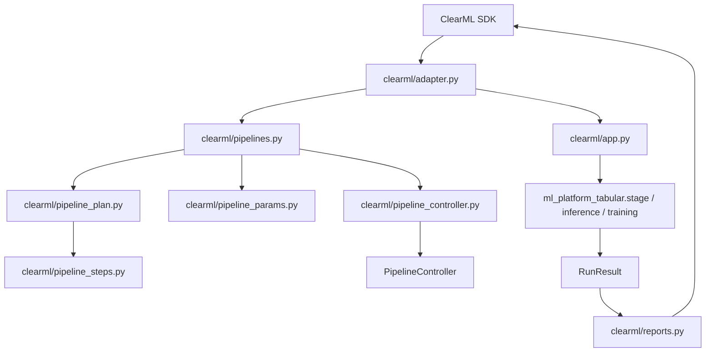

# ClearML Boundary

ClearML-specific behavior lives under `clearml/`. The packages under
`pkgs/core` and `pkgs/tabular` remain ClearML-free so they can run locally,
inside tests, or under another runtime.

## Runtime Shape

## ClearML Runtime Files

| File | Role |
| --- | --- |
| `clearml/adapter.py` | SDK import, Task/Dataset/StorageManager/Logger wrapper. |
| `clearml/source_resolution.py` | Inference source task and artifact resolution. |
| `clearml/app.py` | Direct stage and inference task entrypoint. |
| `clearml/pipelines.py` | Direct pipeline CLI entrypoint. |
| `clearml/pipeline_params.py` | Pipeline New Run defaults and parameter normalization. |
| `clearml/pipeline_plan.py` | Domain plan orchestration and dry-run presentation. |
| `clearml/pipeline_steps.py` | Artifact handoff wiring and ClearML step rendering. |
| `clearml/pipeline_controller.py` | PipelineController draft sync, step registration, and metadata. |
| `clearml/templates.py` | User-facing and internal template sync. |
| `clearml/reports.py` | ClearML reporting orchestration for `RunResult`. |
| `clearml/reporting_scalars.py` | Scalar extraction from metrics artifacts and tables. |
| `clearml/reporting_targets.py` | Table/plot report names and duplicate suppression. |

## Package Boundary

| Package | Role |
| --- | --- |
| `pkgs/core` | Config, IO, artifact, result, and runtime-neutral contracts. |
| `pkgs/tabular` | Tabular data, features, training, inference, plotting, manifest, and domain plan. |

`pkgs/tabular/manifest.py` stays declarative. Pipeline step expansion belongs in
`pkgs/tabular/domain_plan.py`, and stage input/path resolution belongs in
`pkgs/tabular/stage_inputs.py`.

## Adapter Role

The adapter converts ClearML concepts into package-level values without leaking
the SDK into package code.

| ClearML side | Package side |
| --- | --- |
| Dataset ID | Local file path |
| Artifact URL | Local file path |
| Task parameters | Dict config |
| Task ID | `runtime.clearml_task_id` |
| Source task / selector | Model artifact path and info path |

## Notes

The directory is still named `clearml/` for synced template entrypoint
compatibility. New runtime code should import the official SDK through
`adapter.import_clearml_sdk()` or `adapter.import_clearml_symbol()` so the local
directory does not shadow the external package.

Before renaming `clearml/`, create replacement entrypoints, update synced
templates, rebuild existing Pipeline drafts, verify remote Agent training and
inference, archive old tasks, then remove the old entrypoint references.

Do not add model-specific, dataset-specific, or ensemble-specific ClearML
templates. Keep those choices in task parameters and the tabular domain plan.
