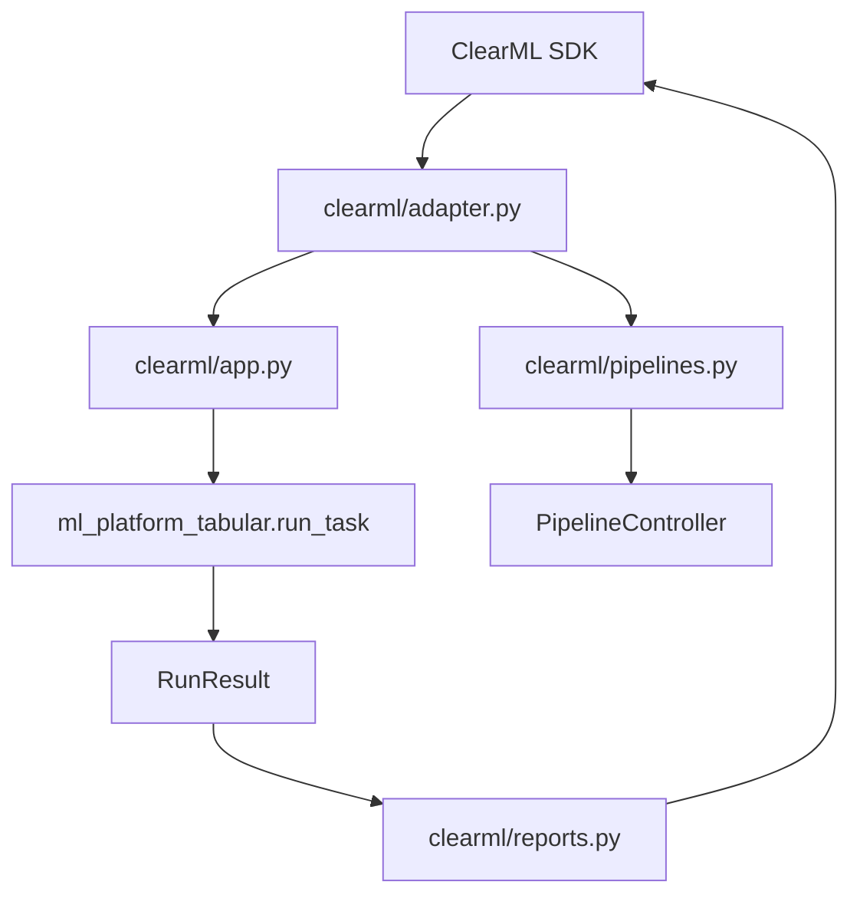

# ClearML 境界

本リポジトリの保守性において最も重要な設計方針は、ClearML SDK 依存を処理本体へ広げないことです。

## 境界の全体像

## ClearML 依存層

| ファイル | ClearML との接点 |
| --- | --- |
| `clearml/app.py` | Task 初期化、UI params 接続、実行 target の更新 |
| `clearml/pipelines.py` | PipelineController、Pipeline parameter、Stage step 定義 |
| `clearml/adapter.py` | SDK import、Dataset 取得、Artifact path 解決、Task metadata |
| `clearml/reports.py` | RunResult を ClearML Scalars/Tables/Plots/Artifacts へ報告 |

## ClearML 非依存層

| パッケージ | 理由 |
| --- | --- |
| `pkgs/core` | Local / test / ClearML 共通の基礎機能であるため |
| `pkgs/tabular` | 学習・評価・推論の本体であり、ClearML なしでも検証できる必要があるため |

## Adapter の役割

Adapter は、ClearML の概念を package code に直接渡さないための変換層です。

| Adapter 処理 | package code へ渡す形 |
| --- | --- |
| Dataset ID の取得 | local path |
| Artifact URL の解決 | local file path |
| UI parameter | dict config |
| Task ID | `runtime.clearml_task_id` |
| source_task_id 推論 | model artifact path / info path |

## 重要な注意点

トップレベルに `clearml/` ディレクトリがあるため、公式 `clearml` SDK と import 名が衝突しやすい構造です。このリポジトリでは、adapter helper が import path を調整して公式 SDK を読むようにしています。

将来的に `clearml/` ディレクトリを rename する場合は、次の順番が安全です。

1. 新しい entrypoint を追加する。
2. テンプレート同期で新 entrypoint を使う。
3. 既存 Pipeline draft を再作成する。
4. 旧 entrypoint を一定期間残す。
5. 古い Task を archive する。
6. 旧ディレクトリ参照を削除する。

## 改修時の禁止事項

- `pkgs/tabular` から `clearml` SDK を import しない。
- モデルごとに ClearML template を増やさない。
- Dataset 固有のテンプレートを作らない。
- ClearML UI に未実装の future 設定を出さない。
- adapter 内の型変換を処理本体へ重複実装しない。
