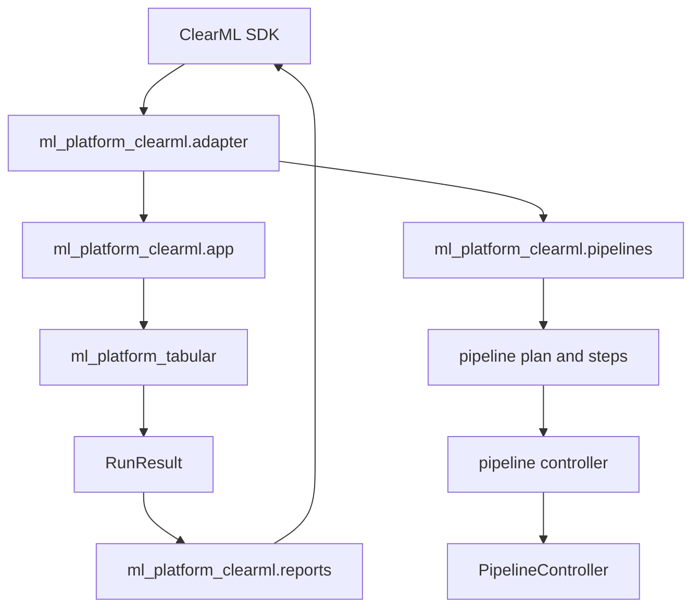

# ClearML Boundary

ClearML-specific behavior lives in `pkgs/clearml/src/ml_platform_clearml`.
The packages under `pkgs/core` and `pkgs/tabular` remain ClearML-free, so their
processing can run locally, in tests, or under another orchestrator.

## Runtime Shape

## Responsibilities

| Area | Modules |
| --- | --- |
| SDK boundary | `adapter.py`, `support.py`, `naming.py` |
| Runtime parameters | `param_bindings.py`, `param_defaults.py`, `param_apply.py`, `param_transport.py` |
| Pipeline | `pipeline_plan.py`, `pipeline_steps.py`, `pipeline_controller.py` |
| Templates and entrypoints | `template_spec.py`, `templates.py`, `app.py`, `pipelines.py` |
| Artifact handoff | `model_source_resolution.py`, `stage_input_resolution.py` |
| Reporting | `reports.py`, `reporting_scalars.py`, `reporting_targets.py` |

## Package Boundary

| Package | Role |
| --- | --- |
| `pkgs/core` | Config, IO, artifact, result, and runtime-neutral contracts. |
| `pkgs/tabular` | Tabular data, features, training, inference, plotting, manifest, and domain plan. |
| `pkgs/clearml` | ClearML orchestration, task integration, template synchronization, and reporting. |

`pkgs/tabular/manifest.py` stays declarative. Pipeline step expansion belongs in
`pkgs/tabular/domain_plan.py`, and stage input/path resolution belongs in
`pkgs/tabular/stage_inputs.py`.

## Adapter Role

The adapter converts ClearML concepts into package-level values without leaking
the SDK into package code.

| ClearML side | Package side |
| --- | --- |
| Dataset ID | Local file path |
| Artifact URL | Local file path |
| Task parameters | Dict config |
| Task ID | `runtime.clearml_task_id` |
| Source task / selector | Model artifact path and info path |

## Compatibility entrypoints

`clearml/app.py` and `clearml/pipelines.py` remain as thin direct-file wrappers
because existing ClearML templates store those paths. They bootstrap workspace
package paths and immediately delegate to `ml_platform_clearml`; they contain no
product behavior and no SDK imports.

Do not add model-specific, dataset-specific, or ensemble-specific ClearML
templates. Keep those choices in task parameters and the tabular domain plan.
