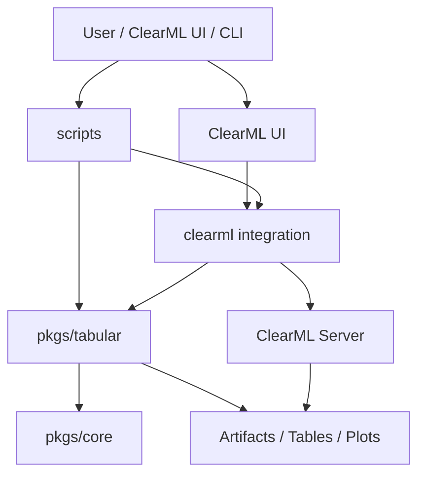
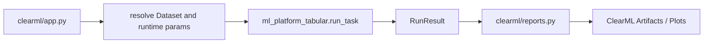

# アーキテクチャ設計概要

`ml_platform` の設計は、ClearML を使う運用層と、学習・前処理・評価・推論を行うドメイン処理を分離することを重視しています。

## レイヤ構成

| レイヤ | 主なディレクトリ | 役割 |
| --- | --- | --- |
| CLI / 操作 | `scripts/` | Local 実行、テンプレート同期、サンプル作成 |
| ClearML integration | `clearml/` | Task 初期化、runtime params 接続、Dataset/Artifact 解決、報告 |
| Core | `pkgs/core` | 設定、IO、Artifact 管理、RunResult |
| Tabular domain | `pkgs/tabular` | データ、特徴量、モデル、評価、推論 |
| Config | `config/` | task/profile 設定 |
| Docs / verification | `docs/`, `verification/` | 仕様、UI、引き継ぎ、検証証跡 |

## ClearML 非依存境界

`pkgs/core` と `pkgs/tabular` は ClearML SDK を import しません。これにより、Local でもテストでも同じ処理を実行でき、ClearML のバージョンやサーバー状態に左右されない単体検証がしやすくなります。

## Stage-based pipeline

学習は 1 つの巨大タスクではなく、Stage に分けて実行します。

| Stage | 責務 | 入力 | 出力 |
| --- | --- | --- | --- |
| `preprocess_features` | データ読込、分割、前処理、品質確認 | Dataset / CSV | 前処理 bundle、feature spec、processed data |
| `train_model` | 候補モデルを学習 | preprocess artifacts | model、metrics、validation predictions |
| `build_ensemble` | 上位モデルからアンサンブル作成 | model refs | ensemble model、members、weights |
| `evaluate_models` | 候補比較、推奨モデル選択 | model refs / ensemble refs | leaderboard、best model |

Stage 分割により、失敗箇所を ClearML UI で追いやすく、モデル候補やアンサンブル方式の追加も Pipeline graph に反映しやすくなります。

## 設計上の有用性

| 観点 | 効果 |
| --- | --- |
| 再現性 | task YAML、profile YAML、runtime params、Artifact が残る |
| 運用性 | Project/Tag/Queue が規約化されている |
| 拡張性 | 新モデルは `model.candidates` と `build_model` で追加できる |
| 可読性 | ClearML 依存を `clearml/` に閉じ、処理本体は `pkgs/tabular` に集約 |
| ユーザー利用 | ClearML UI では Basic 項目から開始できる |
| 判断性 | `best_model.json` が推論への次アクションを示す |

## 注意すべき境界

トップレベルの `clearml/` ディレクトリは公式 `clearml` SDK と名前が似ています。そのため、SDK import は adapter の helper を経由し、リポジトリ内ディレクトリが外部 SDK を shadow しないようにしています。将来的な rename は可能ですが、既存テンプレートの entrypoint と互換性を見ながら段階的に行う必要があります。
