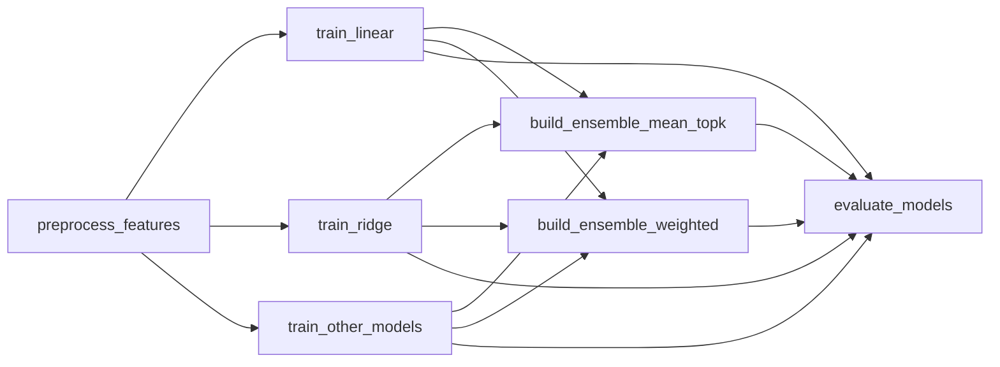
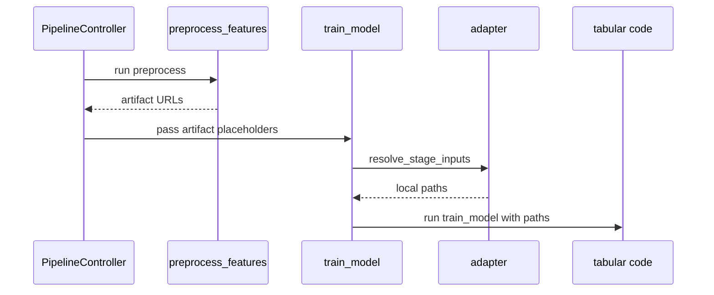

# Pipeline と Stage 設計

学習 Pipeline は、処理を再利用しやすく、ClearML UI で状態を追いやすいように Stage 単位で構成します。

## 公式フロー

## Stage 入出力

| Stage | 主な入力 | 主な出力 | 後続での利用 |
| --- | --- | --- | --- |
| preprocess | dataset, feature config, split config | `preprocess_bundle`, `feature_spec`, processed train/valid | train, ensemble |
| train | preprocess artifacts, model params | `model`, `model_info`, `metrics`, predictions | ensemble, evaluate |
| ensemble | model refs, preprocess artifacts | ensemble model/info, ensemble predictions | evaluate |
| evaluate | model refs, ensemble refs | leaderboard, best model | inference |

## Stage handoff

ClearML Pipeline では、前段 Stage の Artifact URL を後段 Stage に渡します。`ml_platform_clearml.adapter` が実行時に URL を local path に解決し、`pkgs/tabular` には ClearML に依存しない path と JSON refs として渡します。

## なぜ Stage を分けるのか

| 理由 | 効果 |
| --- | --- |
| 失敗箇所の特定 | 前処理、特定モデル、評価のどこで失敗したか分かる |
| 並列性 | モデル候補ごとの学習を ClearML worker に分散しやすい |
| 比較性 | 各モデル Stage が同じ形式の metrics/predictions を出す |
| 拡張性 | モデル追加やアンサンブル追加を Stage 追加で扱える |
| UI 理解性 | ClearML graph で処理全体が見える |

## 評価 Stage の責務

`evaluate_models` は単なるメトリクス集計ではなく、利用者が次に推論へ進むための判断を行う Stage です。

| 出力 | 役割 |
| --- | --- |
| `leaderboard.csv` | 候補の比較 |
| `best_model.json` | 推論に使う候補と推奨設定 |
| `best_model.joblib` | 推論対象モデル |

## 将来拡張時の考え方

新しい処理を追加する場合、まず次を検討します。

1. 既存 Stage の設定追加で足りるか。
2. 既存 Stage の出力 table/artifact 追加で足りるか。
3. 新しい Stage が本当に必要か。
4. user-facing template を増やさずに表現できるか。

新しい Stage を追加する場合も、`internal/tabular_stage` のような内部テンプレートで切り替える方針を優先します。
