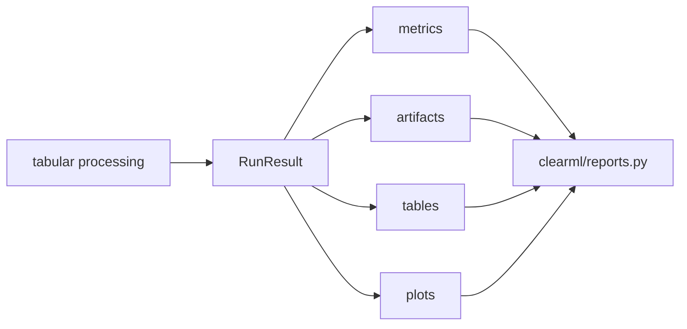

# レポート設計

`ml_platform` では、処理結果を Local のファイルとして残し、ClearML 実行時には同じ結果を Scalars、Tables、Plots、Artifacts として報告します。

## RunResult

処理本体は `RunResult` を返します。

## レポートの原則

| 原則 | 内容 |
| --- | --- |
| Canonical 名を決める | UI で見るべき table/artifact 名を明確にする |
| 互換 alias を増やしすぎない | 古い名前が残ると利用者が迷う |
| 全候補 Plot を出しすぎない | 比較は `leaderboard.csv`、診断 Plot は best 中心 |
| 判断情報を分散させない | 推論判断は `best_model.json` に集約する |
| 推論結果は slim にする | ID、prediction、軽量 metadata を中心にする |

## ClearML 表示の考え方

| 表示種別 | 例 | 用途 |
| --- | --- | --- |
| Scalars | `rmse`, `mae`, `r2` | 比較やフィルタに使う |
| Tables | `leaderboard`, `schema_check_summary` | UI で詳細確認する |
| Plotly | leaderboard metric panel | 判断しやすい図にする |
| Image | residual histogram, feature importance | 画像として確認する |
| Artifacts | joblib, json, csv, md | 再利用・ダウンロード・証跡 |

## Best model

`best_model.json` は、評価結果から推論設定へつなぐ canonical artifact です。ClearML UI ユーザーは、まずこの JSON で推奨モデルと `Model/source_task_id`、`Model/model_selector` を確認します。

## Reporting 改修時の確認

- 新しい table は `clearml/reports.py` の表示対象に含める。
- 重要な JSON は Artifact として必ず upload する。
- Plot は冗長にならないよう top-k または best に絞る。
- 推論 Task では候補比較 Plot を出さない。
- Local と ClearML で出力名が変わらないようにする。
