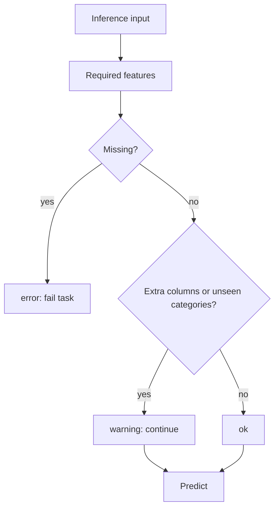

# ClearML UI: 推論 Task

推論は `template/tabular_infer` から実行します。学習 Pipeline の一部ではなく、独立した user-facing Task です。

## 推奨設定

| パラメータ | 推奨 | 説明 |
| --- | --- | --- |
| `Model/source_type` | `task_id` | ClearML の学習結果からモデルを取得 |
| `Model/source_task_id` | 評価または学習 Task ID | `best_model.json` の推奨設定を参照 |
| `Model/model_selector` | `best` | 評価結果の推奨モデルを使用 |
| `Input/clearml_dataset_id` | 推論 Dataset ID | 推論入力データ |
| `Input/local_path` | 通常は空 | Agent から見える local path の場合のみ |
| `Input/id_columns` | 業務ID列 | 結果に残す ID |

## model_selector

| selector | 意味 |
| --- | --- |
| `best` | 評価 Stage が選んだ最良候補 |
| `ridge` など | 指定モデル名の成果物 |
| `ensemble` | 標準または最良アンサンブル |
| `ensemble:mean_topk` | 指定方式のアンサンブル |
| `ensemble:weighted` | 重み付きアンサンブル |
| `ensemble:median` | median アンサンブル |

## UI 上で最初に確認するもの

| 出力 | 確認内容 |
| --- | --- |
| `schema_check_summary` | 入力列が学習時仕様と合うか |
| `source_summary` | 参照した Task と selector が意図通りか |
| `prediction_summary` | 予測値の最小、最大、平均、分位など |
| `prediction_preview` | 先頭行の ID と予測値 |
| `predictions.csv` | 業務利用する予測結果 |

## schema_check の判断

## 実務利用時の注意

- `predictions.csv` は全特徴量を含まないため、必要な業務列は `id_columns` に指定する。
- `source_summary.csv` を保存し、どの学習 Run 由来の予測か追跡できるようにする。
- `schema_check_summary.status=warning` の場合は、予測結果をそのまま利用せず、余剰列や未学習カテゴリの内容を確認する。
- 本番的な継続運用では、`prediction_summary.csv` を蓄積して分布変化を確認する。
