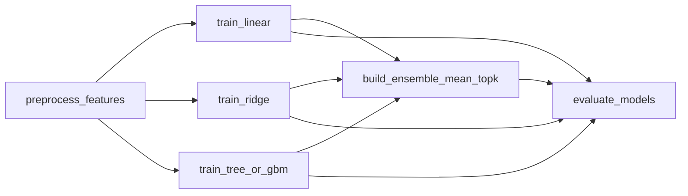
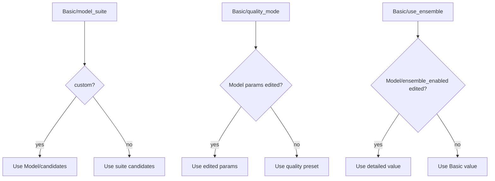

# ClearML UI: 学習 Pipeline

学習 Pipeline は、ClearML UI から `template/tabular_train_pipeline` を New Run して実行します。ユーザーはまず Basic 項目を設定し、必要に応じて詳細項目を調整します。

## Pipeline graph

## Basic パラメータ

| パラメータ | 値 | 説明 |
| --- | --- | --- |
| `Basic/model_suite` | `default` | 全対応モデルを候補にする |
|  | `fast` | optional dependency を含まない軽量候補 |
|  | `interpretable` | 線形・正則化モデル中心 |
|  | `tree` | scikit-learn Tree 系 |
|  | `gbm` | LightGBM、XGBoost、CatBoost |
|  | `custom` | 詳細 `Model/candidates` を直接使う |
| `Basic/quality_mode` | `fast` | 推定器数を抑えた確認用 |
|  | `standard` | 標準設定 |
|  | `quality` | 推定器数をやや増やす。HPO ではない |
| `Basic/use_ensemble` | `true` / `false` | アンサンブル Stage を作るか |
| `Basic/notes` | 任意 | Run の目的・条件メモ |

## 詳細パラメータ

| パラメータ | 型 | 例 | 説明 |
| --- | --- | --- | --- |
| `Input/feature_columns` | list/csv | `x1,x2,x3` | 明示的に使う特徴量 |
| `Input/id_columns` | list/csv | `id` | 推論結果に残す ID |
| `Split/method` | string | `random` | holdout 分割方式 |
| `Split/valid_size` | float | `0.2` | validation 比率 |
| `Split/group_column` | string | `customer_id` | group 分割用 |
| `Split/time_column` | string | `date` | time 分割用 |
| `Features/drop_columns` | JSON/list | `["memo"]` | 除外列 |
| `Features/passthrough_columns` | JSON/list | `["ratio"]` | 数値のまま渡す列 |
| `Model/candidates` | JSON/list | `["ridge","random_forest"]` | 候補モデル |
| `Model/model_params_by_name` | JSON object | `{...}` | モデル別パラメータ |
| `Model/ensemble_methods` | JSON/list | `["mean_topk","median"]` | アンサンブル方式 |
| `Model/ensemble_top_k` | int | `3` | アンサンブルに使う上位数 |
| `Model/selection_metric` | string | `rmse` | モデル選択指標 |

## Basic と詳細の優先順位

## Stage 結果の確認

| Stage | 確認対象 | 期待 |
| --- | --- | --- |
| `preprocess_features` | `data_quality_warnings` | 致命的な警告がない |
| `train_<model>` | `metrics`, `validation_predictions` | 指標と残差が妥当 |
| `build_ensemble_<method>` | `ensemble_metrics_table`, weights | 単体 best と比較する |
| `evaluate_models` | `best_model.json`, `leaderboard` | 推論に使う候補が明確 |

`train_<model>` と `build_ensemble_<method>` は ClearML 上の step label です。package stage key は `train_model` と `build_ensemble` のまま固定します。

## 推奨運用

- 初回は `Basic/model_suite=fast` で worker と Dataset の疎通を確認する。
- 問題なければ `default` または目的に応じた suite に広げる。
- GBM 系が dependency error で失敗する場合は、ClearML Agent image または remote package sync を見直す。
- `best_model.json` の推奨推論設定を確認してから推論 Task を作る。
