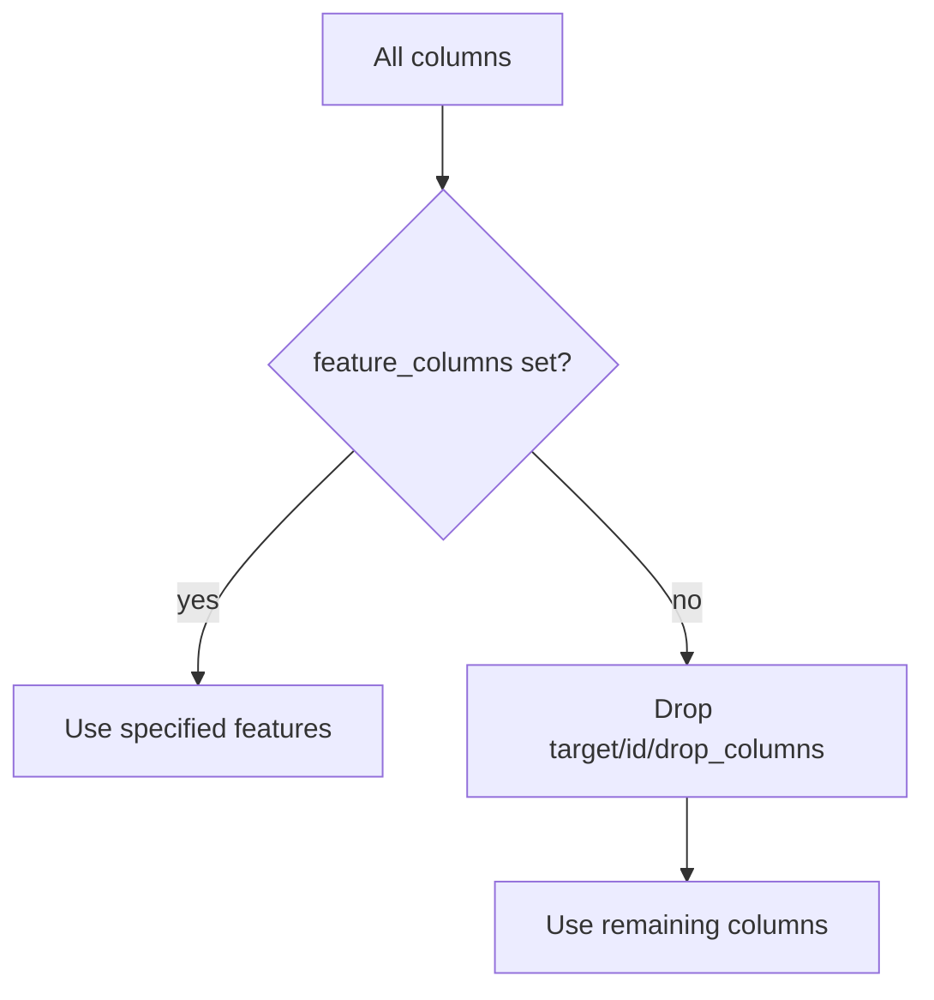

# 前処理と特徴量

本基盤の特徴量処理は、テーブル回帰で必要な基本処理に絞って実装されています。過度な自動特徴量生成は行わず、学習時と推論時の一貫性を重視します。

## 特徴量選択

特徴量は次の順で決まります。

1. `data.feature_columns` が指定されていれば、その列を使う。
2. 指定がなければ、target、id_columns、drop_columns を除いた列を使う。
3. `passthrough_columns` は特徴量として選ばれている必要がある。

## feature preset

| preset | 内容 |
| --- | --- |
| `basic` | 数値 + カテゴリ one-hot を利用 |
| `numeric_only` | カテゴリ列を落とし、数値列中心で学習 |

## 数値処理

| 設定 | 値 | 内容 |
| --- | --- | --- |
| `numeric_impute_strategy` | `median` | 中央値補完 |
|  | `mean` | 平均補完 |
|  | `zero` | 0 補完 |
| `scaling` | `standard` | 平均0、標準偏差1 に変換 |
|  | `none` | スケーリングしない |

標準化は、線形モデルや正則化モデルの安定性に有効です。一方で Tree 系モデルでは必須ではありません。複数モデル比較では同じ前処理を使うため、全体の一貫性を優先します。

## カテゴリ処理

| 設定 | 値 | 内容 |
| --- | --- | --- |
| `categorical_impute_strategy` | `missing_token` | 欠損を `__missing__` として扱う |
|  | `mode` | 最頻値で補完 |
| `categorical_encoder` | `onehot` | 学習時カテゴリを one-hot 化 |
|  | `drop` | カテゴリ列を使わない |

推論時に学習時に存在しなかったカテゴリが出る場合、該当列は `schema_check_summary` で warning になります。

## passthrough_columns

`passthrough_columns` は、補完や標準化を行わず数値列としてそのまま渡す列です。欠損や非数値があるとエラーになります。既に比率やスコアなどとして完成している列に使います。

## feature_spec.json

`feature_spec.json` は、学習時の特徴量契約です。

| 項目 | 推論時の役割 |
| --- | --- |
| `feature_columns` | 必須特徴量の確認 |
| `id_columns` | 予測結果へ残す ID の候補 |
| `numeric_columns` | 数値変換の説明 |
| `categorical_columns` | カテゴリ処理の説明 |
| `transformed_columns` | 変換後列の確認 |
| `feature_config` | 前処理再現性 |

## 改修方針

特徴量処理を追加する場合は、次の点を守ります。

- 学習時に fit した情報を `preprocess_bundle.joblib` に保存する。
- 推論時に同じ transformer を使う。
- `feature_spec.json` に人間が理解できる設定を残す。
- ClearML 依存を入れない。
- UI 設定を増やしすぎず、まず `features.params` で扱えるか検討する。
