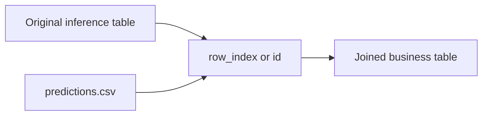

# 推論の実務利用

推論は、学習時の特徴量契約を守りながら、業務データへ予測値を返す処理です。実務利用では、予測精度だけでなく、入力スキーマ、モデル由来、ID 結合、分布変化を確認します。

## 実務推論で重要な4点

| 観点 | 確認する成果物 | 理由 |
| --- | --- | --- |
| 入力スキーマ | `schema_check_summary` | 学習時と同じ特徴量で推論しているか |
| モデル由来 | `source_summary` | どの Run / selector を使ったか |
| 結果結合 | `predictions.csv` | ID列または row_index で業務データに戻せるか |
| 予測分布 | `prediction_summary` | 極端な分布変化がないか |

## 推論入力の準備

推論データは、学習時に使った `feature_columns` を含む必要があります。余剰列は warning ですが、必須列が不足すると error になります。

| 入力列の状態 | 動作 |
| --- | --- |
| 必須特徴量がすべてある | 推論可能 |
| 余剰列がある | warning。推論は継続 |
| ID列が不足 | warning。結果結合に注意 |
| 必須特徴量が不足 | error。Task 失敗 |
| 未学習カテゴリがある | warning。推論は継続 |

## predictions.csv の結合

`predictions.csv` は slim な形式です。全入力列を含まないため、業務テーブルへ戻すには `row_index` または `id_columns` を使います。

## 推論結果の分布確認

`prediction_summary.csv` では、予測値の平均、分位、最小、最大などを確認します。前回実行や学習時 target 分布と大きく異なる場合は、入力データの条件違い、スキーマ warning、データ更新の影響を確認してください。

## 継続運用時の推奨

- 推論 Task ごとに `source_summary.csv` を保存する。
- `schema_check_summary.status` が warning の Run を一覧できるようにする。
- `prediction_summary.csv` を時系列で蓄積する。
- 業務側で利用した `predictions.csv` と Task ID を紐づける。
- モデル更新時は、旧モデルと新モデルの同一入力に対する差分を確認する。

## 将来の Drift Monitoring

現行リリースでは Drift Monitoring は実装していません。将来は、蓄積された `schema_check_summary`、`prediction_summary`、`source_summary` をもとに、入力分布と予測分布の変化を比較する方針です。
