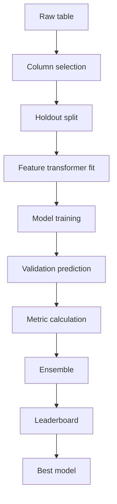
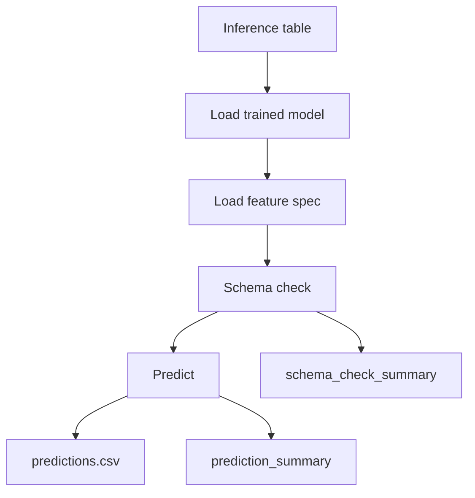

# データサイエンス: 処理ワークフロー

この章では、テーブルスカラー回帰として見たときの処理内容を整理します。

## 学習ワークフロー

## データ品質確認

`preprocess_features` では、学習に入る前に軽量なデータ品質情報を出します。

| 観点 | 内容 | 目的 |
| --- | --- | --- |
| 行数・列数 | `row_count`, `column_count` | データサイズ把握 |
| target 欠損 | `target_missing_count` | 学習対象の妥当性確認 |
| target 数値性 | `target_is_numeric` | 回帰タスクとして扱えるか |
| 重複 | `duplicate_row_count` | データ重複の影響確認 |
| ID 重複 | `id_duplicate_count` | 推論結果との結合リスク確認 |
| 高欠損列 | `high_missing_columns` | 欠損処理や列除外判断 |
| 高 cardinality | `high_cardinality_columns` | one-hot 膨張リスク確認 |
| リーク疑い | `possible_leakage_columns` | target/予測由来列の混入確認 |

## 分割設計

現行では単一 holdout validation を採用しています。

| method | 特徴 | 使うべき場面 |
| --- | --- | --- |
| `random` | seed 固定 shuffle | 一般的な初期比較 |
| `group` | group 単位で分割 | 同一顧客・設備・店舗のリーク防止 |
| `time` | 時系列昇順の末尾を validation | 過去から未来を予測する問題 |
| `fixed` | 指定フラグの行を validation | データ側で検証行が決まっている場合 |

K-fold や外部 validation は現行実装では未対応です。まず holdout の意味を明確にし、評価結果の前提を `feature_spec.json` や `data_quality_summary` に残します。

## モデル比較

各候補モデルは同じ前処理、同じ validation split で比較されます。これにより、モデル差分が前処理や分割の差ではなく、モデル自体の差として見やすくなります。

## アンサンブルの位置づけ

アンサンブルは、個別モデルの弱点を平均化するための候補です。ただし、常に最良とは限りません。`leaderboard.csv` で単体モデルと同じ候補として比較し、採用可否を確認します。

## 推論ワークフロー

推論では、学習時の特徴量仕様と入力列の整合性が重要です。必須特徴量の不足は error、余剰列や未学習カテゴリは warning として扱います。
