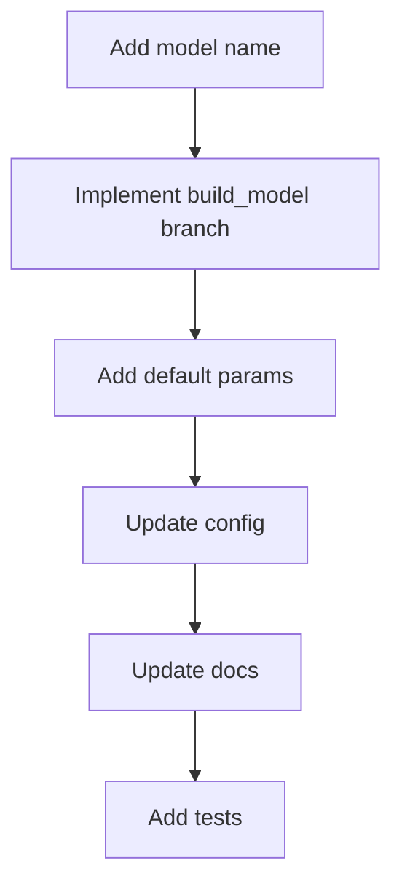

# モデル追加ガイド

新しい回帰モデルを追加する場合は、ClearML テンプレートを増やさず、既存の候補モデル機構に組み込みます。

## 追加手順



## 1. モデル名を追加する

`pkgs/tabular/src/ml_platform_tabular/models.py` の対応モデル一覧へ追加します。

- 依存が軽い場合: `DEPENDENCY_FREE_MODELS`
- optional dependency の場合: `OPTIONAL_DEPENDENCY_MODELS`
- 現行範囲外として明示する場合: `OUT_OF_SCOPE_MODELS`

## 2. `build_model` を追加する

`build_model(name, params)` に分岐を追加します。

注意点:

- `params` は dict として受け取る。
- `random_state` や `n_jobs` の既定値を明示する。
- optional dependency は import 失敗時に分かりやすいエラーを出す。
- 推論時に pickle/joblib で復元できる estimator にする。

## 3. 設定を追加する

`config/tasks/tabular_pipeline.yaml` の `model.params` と `model.candidates` を更新します。

```yaml
model:
  params:
    new_model:
      random_state: 42
  candidates:
    - new_model
```

ClearML UI の `Basic/model_suite` に含める場合は、`clearml/pipelines.py` の suite 定義も更新します。

## 4. feature importance 対応

モデルが `feature_importances_` または `coef_` を持つ場合、既存の feature importance 出力で利用できる可能性があります。対応できない場合は、無理に出力しないでください。

## 5. テスト

最低限、次を確認します。

| テスト | 内容 |
| --- | --- |
| model name validation | 対応モデルとして認識される |
| build_model | params 付きで生成できる |
| local smoke | 小さいデータで学習できる |
| optional dependency | 未導入時のエラーが分かりやすい |

## 追加時に避けること

- `template/train_new_model` のようなモデル別テンプレートを作る。
- `pipeline.py` にモデル固有ロジックを増やす。
- UI に raw な大量パラメータを出す。
- 依存が重いパッケージを必須 dependency にする。
