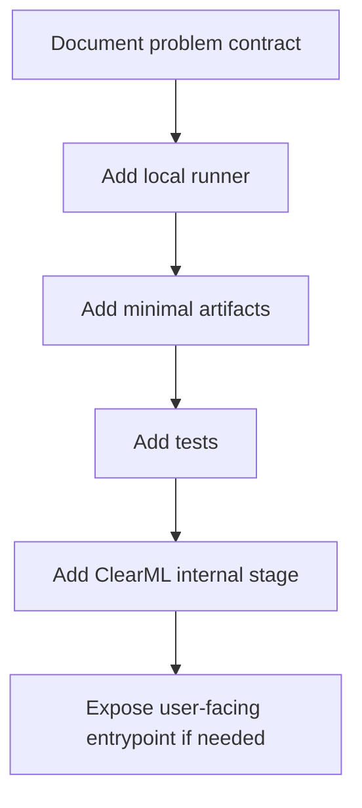

# 新しいタスク/解析への拡張

将来的には、テーブル条件入力に対する 1D/2D 出力、分布モード分解、別種の解析タスクを追加する可能性があります。ただし、現行製品は tabular scalar regression に絞っています。

## 現行でやらないこと

| 項目 | 理由 |
| --- | --- |
| 汎用 Task Registry の先行実装 | 実要件が固まる前に抽象化すると読みにくくなる |
| 新しい user-facing template の乱立 | ClearML UI が複雑化する |
| 未完成設定を UI に出す | 利用者が実装済みと誤解する |
| HPO/Drift/Registry の半実装 | 運用ルールなしでは保守負荷だけが増える |

## 拡張の判断基準

新しい task type を追加する前に、次を確認します。

1. 既存の tabular scalar regression の設定追加で表現できないか。
2. 出力 shape、評価指標、推論結果形式が本質的に異なるか。
3. ClearML UI ユーザーに新しい入口を見せる必要があるか。
4. Artifact 契約を既存と分ける必要があるか。
5. Local で ClearML 非依存に実行できるか。

## 推奨する段階的進め方

## Problem contract の例

新しい task type を追加する場合、まず docs に次を定義します。

| 項目 | 内容 |
| --- | --- |
| 入力 | テーブル、ターゲット、ID、条件列 |
| 出力 | scalar、vector、grid、distribution など |
| 評価指標 | 何を最適化するか |
| 推論結果 | CSV/Parquet/JSON の形式 |
| 必須 Artifact | モデル、変換器、仕様 JSON |
| ClearML 表示 | どの table/plot を見るか |

## 実装時の推奨境界

- 新しい処理本体は `pkgs/tabular` または新 package に置く。
- ClearML SDK は `clearml/` からだけ使う。
- Task-specific template は最小限にする。
- 既存 task の UI を壊さない。
- docs/SPEC.md と ROADMAP.md を更新する。
