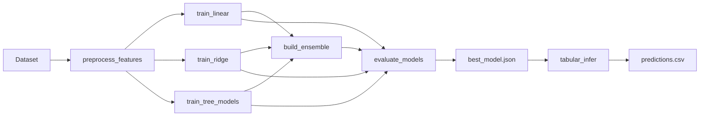
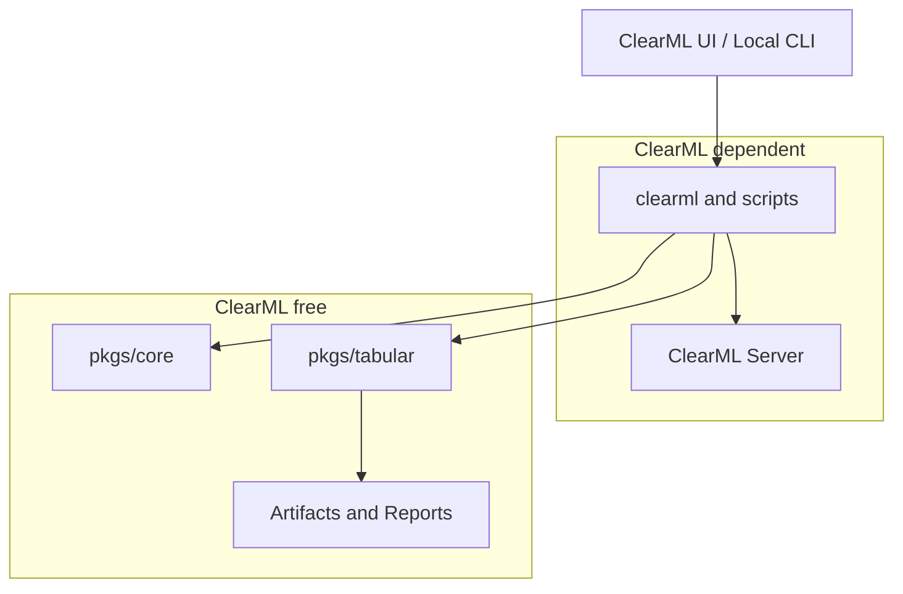

# ml_platform ドキュメント

`ml_platform` は、ClearML を実行管理基盤として利用し、テーブルデータに対するスカラー回帰の学習、モデル比較、アンサンブル、評価、推論を一貫して扱うための機械学習プラットフォームです。

このドキュメントは、初めて本リポジトリを読むデータサイエンティスト、アーキテクト、エンジニアが、背景・使い方・設計・改修方針を短時間で把握できるように整理しています。

## この基盤で解決したいこと

多くの分析プロジェクトでは、モデル学習そのものよりも、次のような周辺作業に時間がかかります。

| 課題 | ml_platform での扱い |
| --- | --- |
| 実行条件が人ごとに異なる | YAML 設定と ClearML UI パラメータに集約する |
| モデル比較結果が残りにくい | `leaderboard.csv`、メトリクス、プロット、Artifact を標準出力にする |
| 前処理と推論時のスキーマがずれる | `feature_spec.json` と推論時の `schema_check_summary` で確認する |
| ClearML のタスクが増えて把握しづらい | Project、Task 名、Tag、Stage を規約化する |
| コードを読まないユーザーが実行しづらい | `Basic/model_suite` など、ClearML UI の基本項目を設ける |
| 改修時に ClearML 依存が内部処理へ広がる | `pkgs/core` と `pkgs/tabular` を ClearML 非依存に保つ |

## 製品フロー

学習は Stage 分割された Pipeline として実行されます。推論は学習 Pipeline から独立した Task として実行します。

## 主な利用者

| 利用者 | 主な関心 | 読むべき章 |
| --- | --- | --- |
| ClearML UI ユーザー | データセットを選び、学習・推論を実行し、結果を確認したい | [ClearML 学習](usage/clearml-training.md)、[結果の読み方](usage/result-reading.md) |
| データサイエンティスト | 前処理、モデル、評価指標、推論結果の妥当性を見たい | [データサイエンス](data-science/workflow.md)、[モデルとアンサンブル](reference/models.md) |
| アーキテクト | 設計境界、依存関係、拡張しやすさを確認したい | [設計概要](architecture/overview.md)、[ClearML 境界](architecture/clearml-boundary.md) |
| 開発者 | 新しいモデル・特徴量・メトリクスを追加したい | [開発ガイドライン](development/guidelines.md)、[モデル追加](development/add-model.md) |
| 運用担当 | テンプレート同期、Queue、失敗時の確認点を知りたい | [ClearML 準備](setup/clearml-preparation.md)、[トラブルシューティング](operations/troubleshooting.md) |

## ドキュメントの読み方

初めて使う場合は、次の順番で読むと理解しやすくなります。

1. [導入: 全体像](setup/index.md)
2. [環境構築](setup/environment.md)
3. [Local 実行](setup/local-run.md)
4. [ClearML 学習](usage/clearml-training.md)
5. [結果の読み方](usage/result-reading.md)
6. [アーキテクチャ設計概要](architecture/overview.md)

既に運用している場合は、[設定項目](reference/configuration.md)、[成果物一覧](reference/artifacts.md)、[トラブルシューティング](operations/troubleshooting.md) を参照してください。

## 設計上の基本方針

このリポジトリでは、次の境界を重視します。

- ClearML SDK に触る処理は運用層へ閉じ込める。
- モデルや特徴量処理は ClearML を知らない純粋な Python パッケージとして保つ。
- ユーザー向けテンプレートを増やしすぎず、設定と Stage で振る舞いを変える。
- 将来機能は、未完成のまま UI に出さず、ロードマップとして明示する。

## 外部参照

- GitHub リポジトリ: <https://github.com/dkawa2523/ml_platform>
- ClearML Documentation: <https://clear.ml/docs/latest/docs/>
- Material for MkDocs: <https://squidfunk.github.io/mkdocs-material/>
