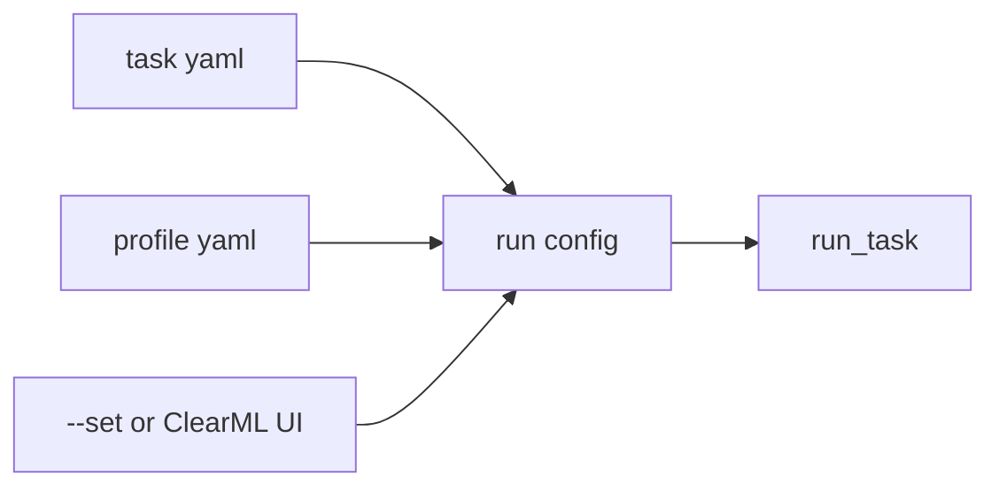

# 設定項目リファレンス

この章では、主要 YAML と ClearML UI パラメータの意味を整理します。設定は task YAML と profile YAML に分かれます。

## task YAML と profile YAML

| 種類 | 例 | 役割 |
| --- | --- | --- |
| task YAML | `config/tasks/tabular_pipeline.yaml` | 処理内容、データ、モデル、出力設定 |
| profile YAML | `config/profiles/local.yaml` | 実行環境、出力先、ClearML 利用有無 |
| ClearML profile | `config/profiles/clearml-dev.yaml` | Project、Queue、Docker image、Dataset 初期値 |

## `run`

| 項目 | 型 | 例 | 説明 |
| --- | --- | --- | --- |
| `run.name` | string | `tabular_training_pipeline` | 実行名 |
| `run.seed` | int | `42` | random split やモデルの seed |
| `run.stage` | string | `preprocess_features` | 内部 Stage 用。ユーザー向け pipeline では通常触らない |

## `data`

| 項目 | 型 | 必須 | 説明 |
| --- | --- | --- | --- |
| `data.local_path` | string | Local では必須 | CSV/Parquet などの入力ファイルまたは Dataset 解決後の local path |
| `data.clearml_dataset_id` | string/null | ClearML remote では推奨 | ClearML Dataset ID |
| `data.dataset_file` | string/null | scalar Dataset で必要 | Dataset 内の対象ファイル |
| `data.source_manifest` | string/null | 複数targetで必要 | Dataset root内のtarget source manifest |
| `data.target_column` | string/null | scalar学習で必要 | 目的変数列。source manifest利用時はnull |
| `data.feature_columns` | list/string/null | 任意 | 明示的に利用する特徴量。target/id/drop/分割制御列は指定不可 |
| `data.id_columns` | list/string | 任意 | 推論結果へ引き継ぐ ID列 |

## `split`

| 項目 | 型 | 対象 method | 説明 |
| --- | --- | --- | --- |
| `split.method` | string | all | `random`, `group`, `time`, `fixed` |
| `split.valid_size` | float | `random`, `group`, `time` | validation 比率。0〜1 の間 |
| `split.group_column` | string/null | `group` | group 単位で train/valid を分ける列 |
| `split.time_column` | string/null | `time` | 時系列順に並べる列 |
| `split.valid_filter_column` | string/null | `fixed` | validation flag 相当の列 |
| `split.valid_filter_value` | string/null | `fixed` | validation とみなす値 |

有効な分割制御列は評価用 metadata として扱い、モデル特徴から除外します。
同じ情報を予測にも使う場合は、元の日時や group から別の特徴量列を作成してください。

## `features`

| 項目 | 値 | 説明 |
| --- | --- | --- |
| `features.preset` | `basic`, `numeric_only` | 特徴量処理 preset |
| `features.numeric_impute_strategy` | `median`, `mean`, `zero` | 数値欠損補完 |
| `features.categorical_impute_strategy` | `missing_token`, `mode` | カテゴリ欠損補完 |
| `features.categorical_encoder` | `onehot`, `drop` | カテゴリエンコード |
| `features.scaling` | `standard`, `none` | 数値標準化 |
| `features.drop_columns` | list | 除外列 |
| `features.passthrough_columns` | list | 補完・標準化せず数値として通す列 |
| `features.params` | object | 将来用または追加設定 |

## `model`

| 項目 | 型 | 説明 |
| --- | --- | --- |
| `model.name` | string | 単一モデル実行時のモデル名 |
| `model.params` | object | モデル別パラメータ |
| `model.candidates` | list | Pipeline で比較する候補モデル |
| `model.selection_metric` | string | `rmse`, `mae`, `r2`, `relative_rmse`, `skill`。複数targetではscale非依存指標を利用 |
| `model.ensemble.enabled` | bool | アンサンブルを作るか |
| `model.ensemble.methods` | list | `mean_topk`, `weighted`, `median` |
| `model.ensemble.top_k` | int | 上位何モデルを使うか |

## `metrics`

| 項目 | 例 | 説明 |
| --- | --- | --- |
| `metrics.names` | `[mae, rmse, r2]` | 出力する評価指標 |

`selection_metric` に指定した指標は、`metrics.names` に含まれていなくても leaderboard 用に追加されます。

## `output`

| 項目 | 型 | 説明 |
| --- | --- | --- |
| `output.upload_plots` | bool | ClearML に Plot 画像をアップロードするか |
| `output.prediction_name` | string | 推論出力ファイル名。通常 `predictions.csv` |

## ClearML Basic パラメータ

| UI パラメータ | YAML 相当 | 説明 |
| --- | --- | --- |
| `Basic/model_suite` | `basic.model_suite` | 候補モデル preset |
| `Basic/quality_mode` | `basic.quality_mode` | 固定パラメータ preset |
| `Basic/use_ensemble` | `model.ensemble.enabled` | アンサンブル有効/無効 |
| `Basic/notes` | `run.description` 相当 | 実行メモ |

## override の考え方

Local では `--set key=value` で YAML を一時上書きできます。ClearML では UI パラメータが task config に反映されます。

