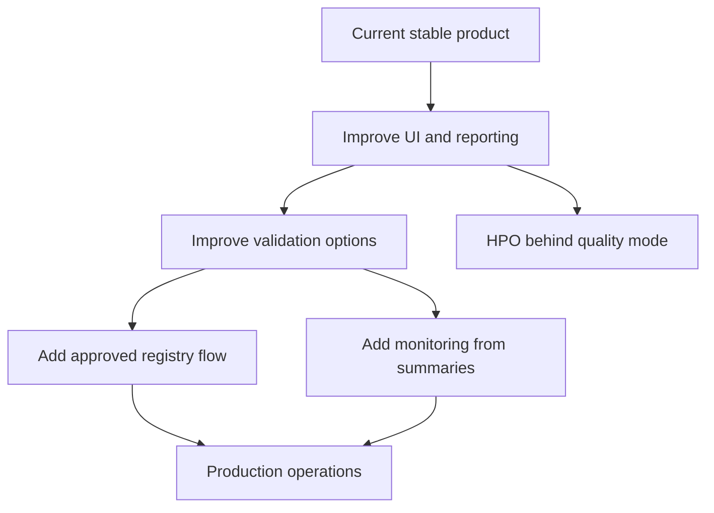

# ロードマップ

このロードマップは、現在の製品範囲と将来拡張を分け、未完成機能が UI やコードに混ざって利用者を迷わせないようにするためのものです。

## 現在の製品範囲

| 項目 | 状態 |
| --- | --- |
| tabular scalar regression | 実装済み |
| Stage-based training pipeline | 実装済み |
| ClearML UI からの学習 | 実装済み |
| ClearML UI からの推論 | 実装済み |
| Local 実行 | 実装済み |
| 複数モデル比較 | 実装済み |
| `mean_topk`, `weighted`, `median` アンサンブル | 実装済み |
| Basic UI controls | 実装済み |
| Holdout split: random/group/time/fixed | 実装済み |
| 軽量 data quality report | 実装済み |
| 推論 schema check | 実装済み |
| best-model decision artifact | 実装済み |

## P2: 将来範囲

以下は重要ですが、現行リリースでは実装しません。先回りして大きな抽象化を入れず、必要になった時点で設計します。

### HPO / Hyperparameter Optimization

| 方針 | 内容 |
| --- | --- |
| 現状 | 未実装 |
| 入れないもの | Optuna、ClearML HyperParameterOptimizer、search stage、raw search space UI |
| 将来方針 | `Basic/quality_mode` の背後に隠し、UI を複雑にしない |
| 実装前提 | 探索結果の集約、best trial の保存、失敗 trial 管理を設計する |

### Model Registry

| 方針 | 内容 |
| --- | --- |
| 現状 | 未実装 |
| 入れないもの | 自動登録、承認フロー、production alias |
| 将来方針 | `evaluate_models` の `best_model.json` から昇格する |
| 実装前提 | 登録基準、承認者、ロールバック方針を決める |

### Drift / Monitoring

| 方針 | 内容 |
| --- | --- |
| 現状 | 未実装 |
| 入れないもの | 定期監視 service、alert、dashboard |
| 将来方針 | `schema_check_summary`, `prediction_summary`, `source_summary` の蓄積から始める |
| 実装前提 | 比較対象、閾値、通知先、保存期間を決める |

### Task Registry

| 方針 | 内容 |
| --- | --- |
| 現状 | 未実装 |
| 入れないもの | 汎用 Task Registry、抽象 class 階層 |
| 将来方針 | 1D/2D 出力や mode decomposition 追加時に再検討 |
| 実装前提 | problem type ごとの入力、出力、評価、推論契約を定義する |

### External validation / CV

| 方針 | 内容 |
| --- | --- |
| 現状 | 未実装 |
| 入れないもの | `external_valid_file`, k-fold, nested CV, `group_kfold` |
| 将来方針 | 評価集約と best model 選択の意味を固めてから入れる |
| 実装前提 | fold 別メトリクス、OOF prediction、最終モデル再学習方針を決める |

## 優先度の考え方

## ガードレール

- 未実装項目を ClearML UI に出さない。
- 新しいテンプレートを増やす前に、既存 Pipeline/Task で表現できないか確認する。
- `pkgs/core` と `pkgs/tabular` に ClearML SDK を入れない。
- Artifact 名と推論契約を安定させる。
- 将来設計は docs に置き、コードに半実装を残さない。
