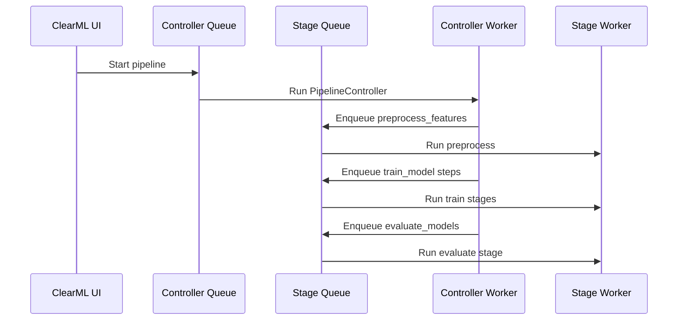

# ClearML 準備

ClearML 実行では、テンプレート同期、Queue、Dataset、Docker image、Artifact storage の設定が重要です。Local 実行で処理内容を確認してから ClearML に同期すると、問題の切り分けがしやすくなります。

## ClearML の役割

ClearML は、このリポジトリでは次の用途に使います。

| 用途 | 内容 |
| --- | --- |
| Task 管理 | 学習 Stage、評価 Stage、推論 Task の実行単位を管理する |
| Pipeline 管理 | Stage の依存関係を PipelineController で定義する |
| Dataset 管理 | UI で Dataset ID と dataset file を選択する |
| Artifact 管理 | モデル、メトリクス、CSV、JSON、画像を保存する |
| 可視化 | Scalars、Tables、Plots で結果を確認する |
| 再現性 | 実行時パラメータ、ソース、タグ、成果物を残す |

ClearML 自体の概念は公式ドキュメントを参照してください。

- <https://clear.ml/docs/latest/docs/>

## テンプレート同期

テンプレート同期は、ClearML UI で利用する Task/Pipeline テンプレートを作成または更新します。

```powershell
uv run python scripts/sync_clearml_templates.py --profile config/profiles/clearml-dev.yaml --dry-run
uv run python scripts/sync_clearml_templates.py --profile config/profiles/clearml-dev.yaml
```

`--dry-run` では、実際に ClearML サーバーを更新せず、作成されるテンプレートや Pipeline 計画を確認できます。

## user-facing と internal の区別

| 種別 | ClearML 表示名 | 利用者 | 役割 |
| --- | --- | --- | --- |
| Pipeline template | `template/tabular_train_pipeline` | UI ユーザー | 学習 Pipeline の起点 |
| Task template | `template/tabular_infer` | UI ユーザー | 推論 Task の起点 |
| Internal task template | `internal/tabular_stage` | PipelineController | 各 Stage の実行用 |

`internal/tabular_stage` は、ユーザーが直接 clone して使う入口ではありません。PipelineController が `Run/stage`、`Model/name`、`stage_inputs` などを上書きして利用します。

## Queue 設計

`clearml-dev.yaml` では、PipelineController 用 Queue と Stage 用 Queue を分けています。

```yaml
clearml:
  controller_queue: controller
  stage_queue: default
```

この分離により、Stage Queue に worker が 1 つしかない場合でも、Controller が worker を占有し続けて Stage が実行されない状態を避けやすくなります。



## Dataset の扱い

ClearML Agent の実行環境から、リポジトリ内の `data/sample_train.csv` が必ず見えるとは限りません。そのため、Remote training では次の設定を使います。

| UI パラメータ | 説明 |
| --- | --- |
| `Input/clearml_dataset_id` | ClearML Dataset の ID |
| `Input/dataset_file` | Dataset 内の対象ファイル名 |
| `Input/target_column` | 目的変数列 |

`Input/local_path` は Local 実行または Agent にマウント済みのパスを使う場合に限ります。

## Docker image と optional dependency

`lightgbm`、`xgboost`、`catboost` を含む default / gbm suite を ClearML 上で使うには、Agent の実行環境にこれらのパッケージが必要です。標準 profile では `clearml.execution.image` を参照し、テンプレート同期時に GBM package を remote execution venv に追加する想定です。

GBM 依存を使えない場合は、ClearML UI で次のいずれかを選びます。

- `Basic/model_suite=fast`
- `Basic/model_suite=interpretable`
- `Basic/model_suite=tree`
- `Basic/model_suite=custom` にして `Model/candidates` から GBM 系を外す

## 同期後の確認

ClearML UI で次を確認してください。

| 確認項目 | 期待値 |
| --- | --- |
| Pipeline tab | `template/tabular_train_pipeline` がある |
| Task templates | `template/tabular_infer` がある |
| Internal template | `internal/tabular_stage` がある |
| Pipeline New Run | `Basic/model_suite`、`Basic/quality_mode`、`Basic/use_ensemble` が見える |
| Project | profile で定義した `MLPlatform/Dev/...` 配下に分かれている |
| Queue | Controller は `controller`、Stage は `default` へ投げられる |
