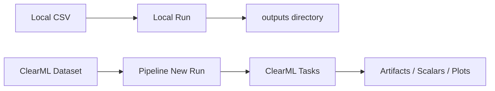

# 導入: 全体像

`ml_platform` は、テーブルデータのスカラー回帰を対象に、学習、複数モデル比較、アンサンブル、評価、推論を標準化する基盤です。Local でも ClearML 上でも同じ設定思想で動かせるように設計されています。

## 何ができるか

| 機能 | 内容 |
| --- | --- |
| 学習 Pipeline | 前処理、モデル学習、アンサンブル、評価を Stage として実行する |
| 複数モデル比較 | 線形系、Tree 系、GBM 系の候補を同一データで比較する |
| アンサンブル | `mean_topk`、`weighted`、`median` を利用できる |
| 評価ダッシュボード | leaderboard、top-k、残差、予測 vs 実測、Pareto を出力する |
| 推論 Task | 学習済み Task または local model path を元に `predictions.csv` を生成する |
| スキーマ確認 | 推論時に必須特徴量、余剰列、未学習カテゴリを確認する |
| ClearML UI 運用 | テンプレート、Project、Tag、Queue を規約化して管理する |

## 実行モード

この基盤は 2 種類の実行モードを想定しています。

| モード | 対象 | 主な入口 | 特徴 |
| --- | --- | --- | --- |
| Local 実行 | 開発者、検証者 | `scripts/local_run.py` | 手元の CSV と YAML 設定で動作確認しやすい |
| ClearML 実行 | UI ユーザー、運用者 | `template/tabular_train_pipeline`、`template/tabular_infer` | Dataset、Queue、Artifact、Plot を ClearML 上で管理する |

## Local と ClearML の役割分担

Local 実行は、処理内容の理解、デバッグ、テスト、軽量な分析に向いています。ClearML 実行は、チーム内での共有、再実行、結果管理、Artifact 管理に向いています。



## 最初に確認するファイル

| ファイル | 役割 |
| --- | --- |
| `README.md` | 最短の実行手順と境界方針 |
| `config/tasks/tabular_pipeline.yaml` | 学習 Pipeline の標準設定 |
| `config/tasks/tabular_stage.yaml` | PipelineController が使う内部 Stage 設定 |
| `config/tasks/tabular_infer.yaml` | 推論 Task の設定 |
| `config/profiles/local.yaml` | Local 実行用 profile |
| `config/profiles/clearml-dev.yaml` | ClearML dev 実行用 profile |
| `docs/SPEC.md` | 製品仕様の基準 |
| `docs/CLEARML_UI_SPEC.md` | ClearML UI の振る舞い仕様 |
| `docs/ROADMAP.md` | 将来範囲と未実装項目 |

## 最短ルート

Local で処理を確認する場合は、次の流れです。

```powershell
uv venv .venv
.\.venv\Scripts\activate
uv pip install -e pkgs/core -e pkgs/tabular -r requirements-dev.txt
python scripts/make_sample_data.py
python scripts/local_run.py --task config/tasks/tabular_pipeline.yaml --profile config/profiles/local.yaml --set "model.candidates=[linear,ridge,lasso,elasticnet,random_forest,extra_trees,gradient_boosting]"
python scripts/local_run.py --task config/tasks/tabular_infer.yaml --profile config/profiles/local.yaml
```

ClearML で使う場合は、テンプレート同期後に UI から Pipeline を起動します。

```powershell
python scripts/sync_clearml_templates.py --profile config/profiles/clearml-dev.yaml --dry-run
python scripts/sync_clearml_templates.py --profile config/profiles/clearml-dev.yaml
```
