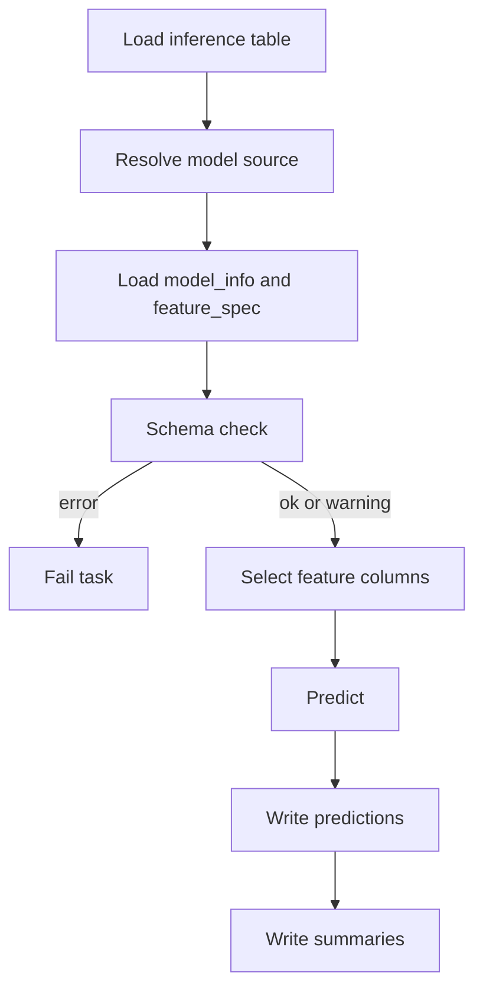

# 推論

推論は、学習 Pipeline から独立した `tabular_infer` Task として実行します。学習済みモデルの取得元は、ClearML Task ID または Local model path です。

## 推論 Task の入口

| 実行モード | 入口 |
| --- | --- |
| Local | `scripts/local_run.py --task config/tasks/tabular_infer.yaml --profile config/profiles/local.yaml` |
| ClearML | `template/tabular_infer` を clone / New Run |

## モデルの指定方法

| 設定 | 説明 |
| --- | --- |
| `Model/source_type=task_id` | ClearML の学習 Pipeline / Stage Task ID からモデルを解決する |
| `Model/source_task_id=<id>` | 参照する学習または評価 Task ID |
| `Model/model_selector=best` | 評価結果の最良モデルを使う |
| `Model/model_selector=<model name>` | 例: `ridge`、`random_forest` |
| `Model/model_selector=ensemble` | 最良または標準アンサンブルを使う |
| `Model/model_selector=ensemble:<method>` | 例: `ensemble:median` |
| `Model/source_type=local_path` | Local の学習出力ディレクトリまたは joblib を使う |
| `Model/local_model_path=<path>` | モデルファイルまたは学習 Run ディレクトリ |

## 推論処理の流れ

## スキーマチェック

推論では、入力データが学習時の特徴量仕様と整合しているか確認します。

| 判定 | 条件 | 動作 |
| --- | --- | --- |
| `ok` | 必須特徴量が揃い、余剰列や未学習カテゴリがない | 推論継続 |
| `warning` | 余剰列、ID列不足、未学習カテゴリなど | 推論継続。結果確認が必要 |
| `error` | 必須特徴量が不足 | Task 失敗 |

出力される `schema_check_summary.csv/json` を確認してください。

## `predictions.csv` の設計

推論結果は、業務データと結合しやすく、かつ過剰に重くならないように slim な形式です。

| 列 | 内容 |
| --- | --- |
| `row_index` | 入力データの行 index |
| ID columns | `data.id_columns` または学習時 `feature_spec` から取得した ID列 |
| `prediction` | 予測値 |
| `model_name` | 解決されたモデル名 |
| `artifact_kind` | `model` または `ensemble` |
| `model_artifact_id` | モデル情報から生成される軽量 ID |
| `prediction_run_id` | 推論 Run 識別子 |

全特徴量はコピーしません。必要に応じて、`row_index` や ID 列で元データと結合します。

## 推論後に見る成果物

| 成果物 | 目的 |
| --- | --- |
| `predictions.csv` | 実務で利用する予測結果 |
| `schema_check_summary.csv/json` | 入力スキーマの確認 |
| `prediction_summary.csv` | 予測値の集計 |
| `prediction_preview.csv` | 先頭行のプレビュー |
| `source_summary.csv` | モデル取得元、selector、モデル種別など |
| `prediction_distribution_histogram.png` | 予測分布の確認 |
| `manifest.json` | 出力成果物の一覧と実行メタ情報 |

## 推論結果の確認手順

1. `schema_check_summary` が `error` でないことを確認する。
2. `source_summary` で意図した学習 Run / モデルが使われたことを確認する。
3. `prediction_summary` で分布が極端にずれていないか確認する。
4. `predictions.csv` を業務側 ID と結合する。
