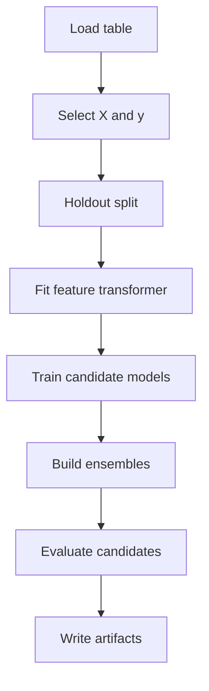

# Local 学習

Local 学習では、`config/tasks/tabular_pipeline.yaml` と `config/profiles/local.yaml` を組み合わせて、ClearML 非依存で学習 Pipeline を実行します。

## 学習設定の中心

`tabular_pipeline.yaml` は、学習 Pipeline の標準設定です。

| セクション | 内容 |
| --- | --- |
| `run` | 実行名、seed |
| `data` | 入力ファイル、目的変数、特徴量列、ID列 |
| `split` | holdout 分割方式 |
| `metrics` | 評価指標 |
| `features` | 前処理・特徴量設定 |
| `model` | 候補モデル、パラメータ、選択指標、アンサンブル |
| `output` | レポートやプロット出力 |

## 実行例

```powershell
uv run python scripts/local_run.py --task config/tasks/tabular_pipeline.yaml --profile config/profiles/local.yaml
```

GBM 系パッケージを入れていない場合は、依存不要モデルに絞ります。

```powershell
uv run python scripts/local_run.py --task config/tasks/tabular_pipeline.yaml --profile config/profiles/local.yaml --set "model.candidates=[linear,ridge,lasso,elasticnet,random_forest,extra_trees,gradient_boosting]"
```

## 処理の流れ

Local 学習でも、ClearML Pipeline と同じ論理構成で処理されます。



## 学習時に出る主要成果物

| Stage | 成果物 | 用途 |
| --- | --- | --- |
| preprocess | `feature_spec.json` | 学習時の特徴量契約 |
| preprocess | `data_quality_summary.json` | データ品質概要 |
| preprocess | `data_quality_warnings.csv` | 欠損、重複、リーク疑いなど |
| train | `model.joblib` | 学習済み estimator |
| train | `model_info.json` | モデル名、特徴量、パラメータ |
| train | `metrics.json` | モデル単体の指標 |
| ensemble | `ensemble_info_*.json` | アンサンブル構成 |
| evaluate | `leaderboard.csv` | モデル比較表 |
| evaluate | `best_model.json` | 推論に使うモデルと推奨設定 |
| evaluate | `best_model.joblib` | 推論で使う推奨モデル |

## `best_model.json` の位置づけ

`evaluate_models` の `best_model.json` は、学習後に最初に確認する判断 artifact です。最良候補、選択指標、推論 Task で指定すべき `source_task_id` と `model_selector` を確認します。

## よく使う override

| 目的 | コマンド例 |
| --- | --- |
| target を変更 | `--set "data.target_column=sales"` |
| ID列を変更 | `--set "data.id_columns=[customer_id]"` |
| 時系列分割 | `--set "split.method=time" --set "split.time_column=date"` |
| group 分割 | `--set "split.method=group" --set "split.group_column=store_id"` |
| モデル候補を限定 | `--set "model.candidates=[ridge,random_forest]"` |
| アンサンブル無効化 | `--set "model.ensemble.enabled=false"` |

## 学習結果の確認順

1. `preprocess_features/data_quality_warnings.csv`
2. `preprocess_features/feature_spec.json`
3. `evaluate_models/best_model.json`
4. `evaluate_models/leaderboard.csv`
5. `evaluate_models/evaluation_predictions.csv`
