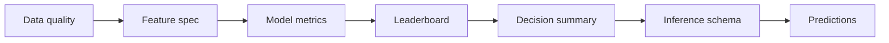

# 結果の読み方

`ml_platform` の出力は、ClearML UI でも Local の `outputs` でも同じ考え方で確認できます。重要なのは、単に Pipeline が成功したかではなく、データ、特徴量、モデル比較、推論設定の順に確認することです。

## 確認順序

## 1. データ品質

最初に `preprocess_features` の成果物を確認します。

| 成果物 | 見るポイント |
| --- | --- |
| `data_quality_summary.json` | 行数、列数、目的変数欠損、ID重複、特徴量数 |
| `data_quality_summary_table.csv` | ClearML UI で見やすい table 形式 |
| `data_quality_warnings.csv` | 高欠損、重複、リーク疑い列など |
| `missing_rate_by_column.csv` | 欠損率上位列 |
| `feature_type_counts.csv` | 数値・カテゴリ・passthrough の内訳 |

警告は必ずしも失敗理由ではありません。ただし、目的変数欠損、ID重複、リーク疑い列は、評価結果の信頼性を大きく下げる可能性があります。

## 2. 特徴量仕様

`feature_spec.json` は、推論時のスキーマ確認にも使われる重要な契約です。

| 項目 | 意味 |
| --- | --- |
| `target_column` | 学習対象 |
| `feature_columns` | 元データから選択した特徴量 |
| `id_columns` | 予測結果に引き継ぐ ID |
| `numeric_columns` | 数値処理対象 |
| `categorical_columns` | カテゴリ処理対象 |
| `transformed_columns` | 変換後の列名 |
| `feature_config` | 補完、エンコード、スケーリング設定 |
| `split` | holdout 分割設定 |

## 3. モデル単体結果

各 `train_<model>` Stage では、モデル単体の評価を確認します。

| 出力 | 内容 |
| --- | --- |
| `metrics.json` | `mae`、`rmse`、`r2` など |
| `metrics_table.csv` | ClearML table 表示用 |
| `validation_predictions.csv` | validation に対する予測 |
| `feature_importance.csv` | 対応モデルでの重要度 |
| `prediction_vs_actual` | 予測 vs 実測 |
| `residual_histogram` | 残差分布 |
| `residual_vs_predicted` | 予測値に対する残差傾向 |

## 4. Leaderboard

`evaluate_models/leaderboard.csv` は、単体モデルとアンサンブルを同じ表で比較する中心成果物です。

| 列 | 意味 |
| --- | --- |
| `rank` | 選択指標に基づく順位 |
| `model_name` | モデル名またはアンサンブル名 |
| `artifact_kind` | `model` または `ensemble` |
| `ensemble_method` | アンサンブル方式 |
| `rmse` | 二乗平均平方根誤差 |
| `mae` | 平均絶対誤差 |
| `r2` | 決定係数 |
| `selection_metric` | 順位付けに使った指標 |

## 5. Decision summary

`decision_summary.md` は、学習結果を推論運用へつなげるための判断メモです。

確認すべき内容は以下です。

- 最良候補のモデル名
- 単体モデルかアンサンブルか
- アンサンブルが単体モデルより改善したか
- 推奨 `Model/model_selector`
- 推論 Task に入れるべき設定例

## 6. 推論結果

推論 Task では、次の順に確認します。

| 確認順 | 成果物 | 見るポイント |
| --- | --- | --- |
| 1 | `schema_check_summary.csv/json` | 必須列不足がないか |
| 2 | `source_summary.csv` | 意図したモデルを使ったか |
| 3 | `prediction_summary.csv` | 予測分布が極端でないか |
| 4 | `prediction_preview.csv` | ID と予測値の見た目 |
| 5 | `predictions.csv` | 業務利用する最終結果 |

## 指標の注意

RMSE、MAE、R2 はそれぞれ見る観点が違います。RMSE は大きな誤差に敏感、MAE は平均的な外れ幅を示し、R2 は目的変数のばらつきに対する説明力を示します。どれか一つだけで判断せず、業務上の損失関数に近い指標を重視してください。
